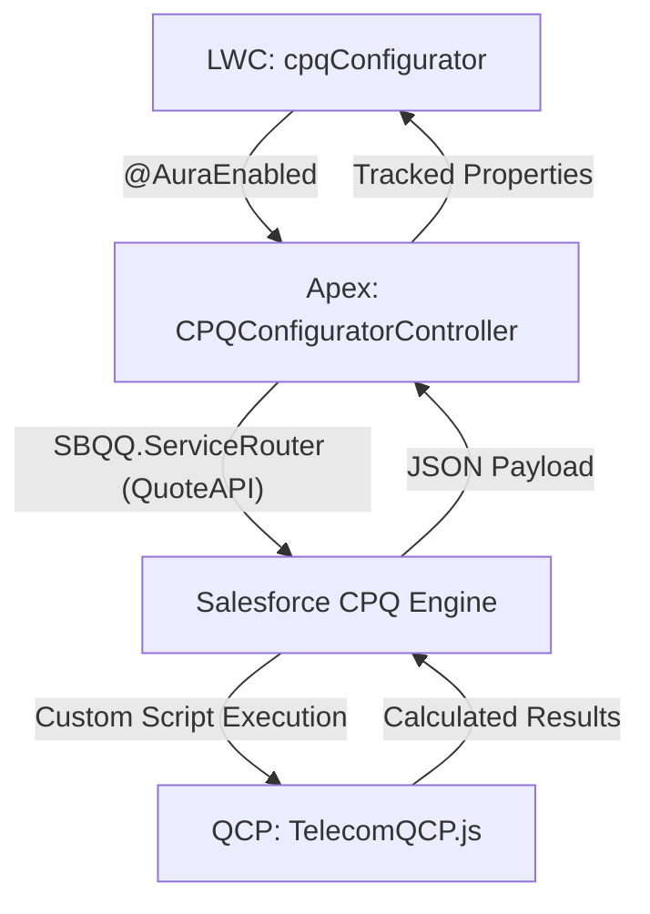

# NexaLink CPQ: Technical Documentation & Architecture Guide

## 1. Overview
NexaLink CPQ is a modern, visual Product Configurator built on top of **Salesforce CPQ**. It replaces the standard "Edit Lines" interface with a premium, glassmorphism-inspired UI that simplifies complex bundle configurations and provides real-time pricing feedback.

---

## 2. Architecture & Communication Flow
The application follows a decoupled architecture where the UI communicates with Salesforce through a robust Apex controller, which in turn interacts with the Salesforce CPQ Managed Package engine.



### How they connect:
1.  **HTML to JS**: User interactions (clicks, drags, inputs) trigger JS functions through standard LWC event handlers (`onclick`, `onchange`, `ondragstart`).
2.  **JS to Apex**: The JS file imports Apex methods and calls them as Promises. Data is often passed as JSON strings to handle complex structures (like bundle configurations).
3.  **Apex to CPQ**: The Apex controller uses the `SBQQ.ServiceRouter` (part of the CPQ API) to read, calculate, and save Quote records.
4.  **CPQ to QCP**: The **Quote Calculator Plugin (QCP)** is a JavaScript script stored in the `SBQQ__CustomScript__c` object. The CPQ engine automatically executes this script during the calculation sequence.

---

## 3. Key Concepts & Notions

### A. Objects & Workflow
*   **Quote (`SBQQ__Quote__c`)**: The primary object where configuration happens.
*   **Order (`Order`)**: Generated from the Quote when `SBQQ__Ordered__c` is set to `true`.
*   **Contract (`Contract`)**: Generated from the Order when `SBQQ__Contracted__c` is set to `true`.
*   **Quote Lines (`SBQQ__QuoteLine__c`)**: Individual products or components added to the quote.

### B. Bundles & Features
*   **Bundle**: A parent product that contains multiple options.
*   **Feature**: A category within a bundle (e.g., "Hardware", "Service") with specific selection rules (Min/Max).
*   **Options**: The actual products selectable within a feature.

### C. Glassmorphism UI
The UI uses modern CSS techniques (backdrop-filter, transparency, subtle gradients) to create a "premium" feel. The "Canvas" allows users to visually organize their quote items.

---

## 4. The Quote Calculator Plugin (QCP)

### What is it?
The QCP is a server-side JavaScript plugin that allows for custom pricing logic that exceeds the capabilities of standard Price Rules.

### Connection to the Org:
1.  Go to **Installed Packages** > **Salesforce CPQ** > **Configure**.
2.  Under the **Plugins** tab, the name of the script (`TelecomQCP`) is entered in the **Quote Calculator Plugin** field.
3.  The script itself is stored in the `SBQQ__CustomScript__c` record in Salesforce.

### Logic Breakdown:
*   **`onBeforeCalculate`**: Called before standard CPQ calculations.
*   **`onAfterCalculate`**: Called after standard calculations. Our logic resides here.
*   **Communication**: It uses a `conn` object (JSForce-like) to query additional data (e.g., checking if the Account is a Student or Employee).
*   **Pricing Engine**: It iterates through `lines`, applying discounts based on:
    *   **Customer Profile**: Student (30 MAD), Employee (80 MAD), New Customer (40 MAD).
    *   **Seasonal**: Ramadan discounts (30 MAD).
    *   **Combo/Bundles**: 20% discount if Home + Mobile are combined.
    *   **Capping**: A safety mechanism that limits total discounts to 20% of the list price.

---

## 5. JavaScript & HTML Interaction Detail

### How HTML calls JS:
In `cpqConfigurator.html`, we use directives like:
```html
<lightning-button onclick={handleCalculateDiscounts}></lightning-button>
```
When clicked, the JS function `handleCalculateDiscounts()` is executed in the controller file.

### How JS updates HTML:
JS uses the `@track` decorator on properties. When a tracked property (like `netPrice` or `canvasItems`) changes in JS, the HTML template automatically re-renders to show the new value.
```javascript
@track netPrice = 0;
// ... inside a function ...
this.netPrice = 150.00; // HTML automatically shows 150.00
```

### Communication Pattern (The "Polling" Mechanism):
Since CPQ calculations can be asynchronous, the JS implementation uses a **Polling** strategy:
1.  JS calls Apex to start calculation.
2.  Apex tells CPQ to calculate via ServiceRouter.
3.  JS sets a timer (`setTimeout`) to call Apex every 600ms.
4.  Apex checks the `SBQQ__Uncalculated__c` flag on the Quote.
5.  Once `false`, JS stops polling and displays the final price.

---

## 6. Order & Contract Automation
This project leverages the **Managed Package Trigger Chain**:
1.  **Mark Ordered**: Setting `SBQQ__Ordered__c = true` on the Quote triggers the CPQ package to create an `Order` and `OrderItems`.
2.  **Activate Order**: Setting `Status = 'Activated'` on the Order is a prerequisite for contracting.
3.  **Mark Contracted**: Setting `SBQQ__Contracted__c = true` on the Order triggers the creation of the `Contract` and `Subscription` records.

---

## 7. Deep Dive: Details of Details

### A. The Drag & Drop "Magic"
The Visual Configurator isn't just a list; it's a coordinate-aware canvas.
*   **HTML Side**: The canvas uses `ondragover` and `ondrop`. Products use `draggable="true"`.
*   **JS Side (`handleCanvasDrop`)**:
    1.  Captures the `clientX/Y` of the drop event.
    2.  Subtracts the canvas bounding box offset to get relative `x, y`.
    3.  Stores these coordinates in a JSON object within `canvasItems`.
    4.  **Persistence**: When clicking "Add to Quote", these coordinates are serialized into the `SBQQ__Description__c` or a custom `Position__c` field on the Quote Line, allowing the UI to reconstruct the layout later.

### B. The JS-to-Apex Communication Pattern
We use **JSON Serialization** for reliability with complex objects.
*   **Example: `syncProductsToQuote`**:
    *   **JS**: `const payload = JSON.stringify(this.canvasItems);`
    *   **Apex**: `public static void syncProductsToQuote(String quoteId, String productsJson)`
    *   **Rationale**: Passing a `List<Map<String,Object>>` from JS to Apex can sometimes lead to type-casting issues. Stringified JSON is the most robust way to pass heavy data structures.

### C. QCP Connection Internals (The "JSForce" Connection)
The QCP script receives a `conn` object in its functions (`onAfterCalculate(quote, lines, conn)`).
*   **What is `conn`?** It is a restricted version of the **JSForce** library. 
*   **Capabilities**: It allows the script to perform **SOQL queries** and **DML operations** synchronously within the pricing engine.
*   **Why use it?** We use it to fetch `Account` attributes (like `Is_Student__c`) that are not directly available on the Quote record without creating formula fields for every single attribute.

### D. The "ServiceRouter" (QuoteAPI)
Inside `CPQConfiguratorController.cls`, we use `SBQQ.ServiceRouter.read('SBQQ.QuoteAPI.QuoteReader', quoteId)`.
*   **Read**: Fetches the full CPQ Object Model (Quote + Lines + Options).
*   **Calculate**: Triggers the calculation engine (and our QCP script).
*   **Save**: Persists the changes back to the database.
*   **Critical Detail**: You cannot simply `update quoteLine;` in Apex and expect prices to be correct. You **MUST** use the `QuoteCalculator` API to ensure the CPQ logic chain (Price Rules, QCP, Rollups) is executed.

### E. Managed Package Trigger Chain (Ordering/Contracting)
1.  **Mark Ordered**: Setting `SBQQ__Ordered__c = true` is NOT enough for success. The Quote must be **Primary** and have **Lines**.
2.  **Order Generation**: The managed package starts an asynchronous job. Our LWC uses `_pollOrderCreation` to check for the new Order ID every 1 second.
3.  **Activation Prerequisites**:
    *   **Pricebook**: The Order MUST have a Pricebook assigned.
    *   **Status**: Transition from `Draft` to `Activated`.
    *   **Contracting**: Once `Activated`, setting `SBQQ__Contracted__c = true` triggers the "Contracting" background job.

---

## 8. Troubleshooting Checklist for Supervisors
*   **Pricing not updating?** Check the `SBQQ__Uncalculated__c` flag on the Quote. If it's `true`, the QCP hasn't finished.
*   **Order not creating?** Check if the Quote is marked as **Primary**. Non-primary quotes cannot be ordered.
*   **Contract generation failing?** Ensure the Order status is **Activated**. Draft orders cannot be contracted.
*   **Discount missing?** Check the **Discount Breakdown** field on the Quote Line. Our QCP writes all its reasoning there for transparency.

---

> [!IMPORTANT]
> **Safety First**: Always update statuses through the provided LWC buttons rather than standard Salesforce fields to ensure the `EffectiveDate` and `Pricebook` are correctly synced for activation.
