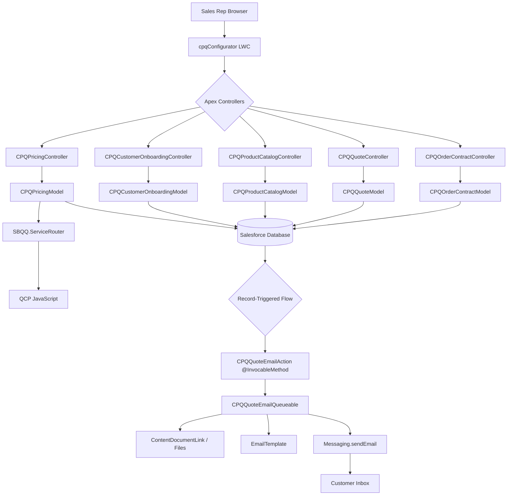
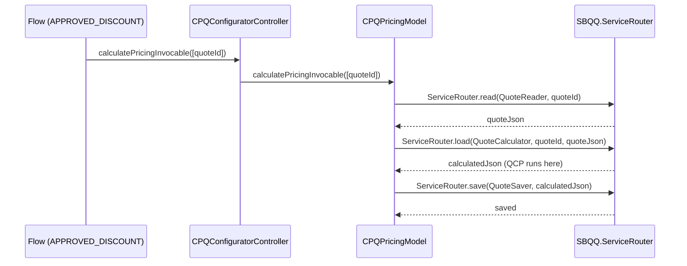
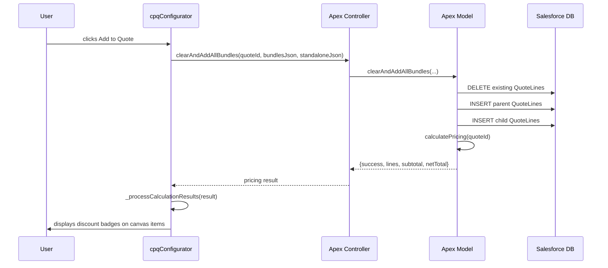
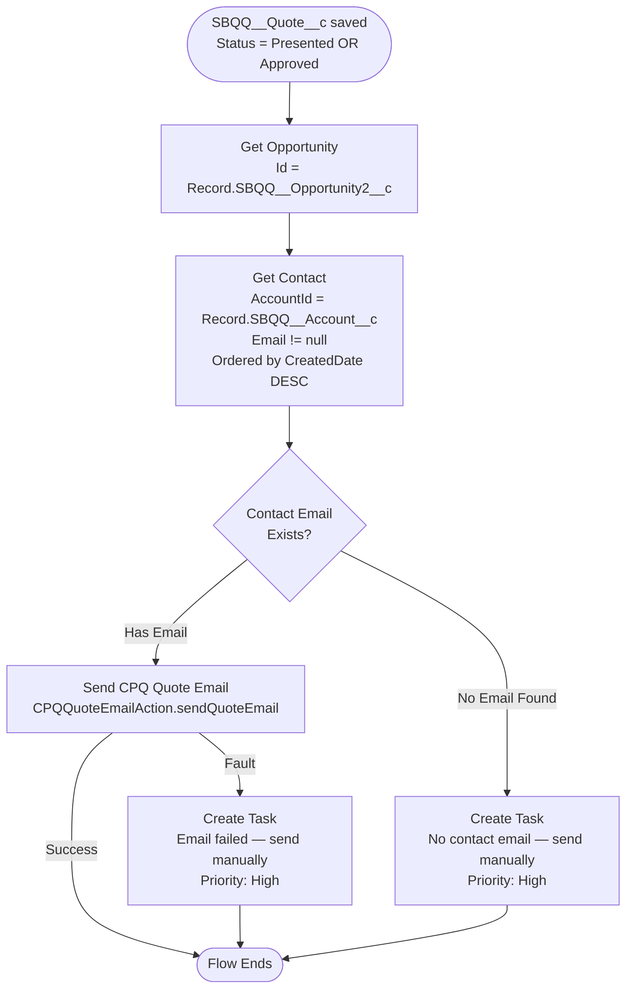
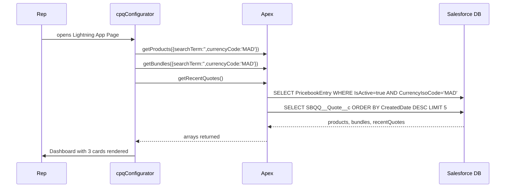
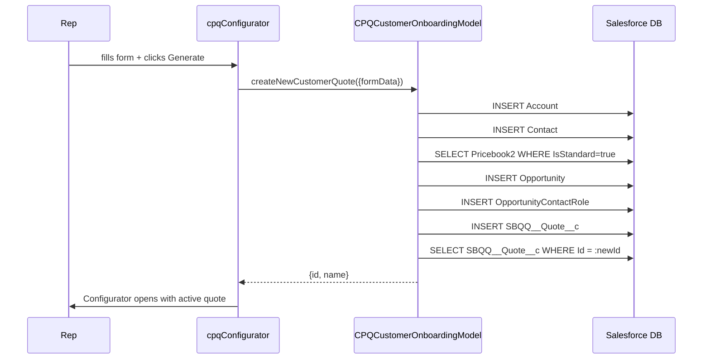
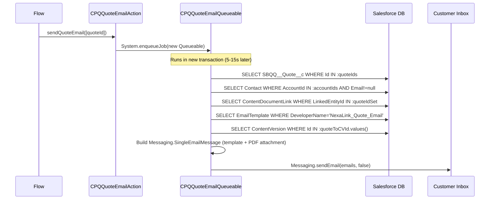
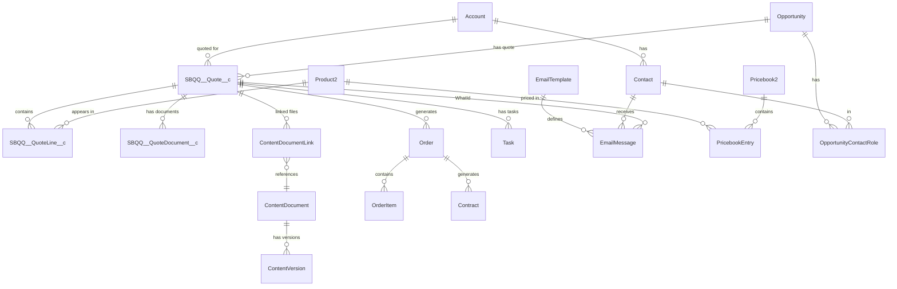

# NexaLink CPQ — Complete Project Documentation
### PFE Defense Reference Guide · Salesforce Intern Edition

---

## Table of Contents
1. [Project Overview](#1-project-overview)
2. [Architecture Overview](#2-architecture-overview)
3. [Salesforce Concepts Used](#3-salesforce-concepts-used)
4. [Apex Deep Dive](#4-apex-deep-dive)
5. [Apex Annotations Deep Dive](#5-apex-annotations-deep-dive)
6. [LWC Deep Dive](#6-lwc-deep-dive)
7. [QCP — Quote Calculator Plugin](#7-qcp--quote-calculator-plugin)
8. [Flow Deep Dive](#8-flow-deep-dive)
9. [End-to-End User Flows](#9-end-to-end-user-flows)
10. [CPQ Concepts Used](#10-cpq-concepts-used)
11. [Data Model Analysis](#11-data-model-analysis)
12. [Technical Decisions](#12-technical-decisions)
13. [Interview Preparation](#13-interview-preparation)
14. [PFE Defense Preparation](#14-pfe-defense-preparation)
15. [Summary Cheat Sheet](#15-summary-cheat-sheet)

---

## 1. Project Overview

### What is NexaLink CPQ?

NexaLink CPQ is a custom **Configure, Price, Quote** solution built on Salesforce CPQ (managed package SBQQ) for a Moroccan telecommunications company. It solves a real business problem: before this system, sales representatives had to manually build quotes in spreadsheets, look up prices in catalogues, calculate discounts by hand, and send PDFs by email individually. This process took hours per quote, introduced pricing errors, and provided no audit trail.

The NexaLink CPQ solution replaces this manual process with:
- A **visual drag-and-drop configurator** built as a Lightning Web Component
- **Automated discount calculation** via a JavaScript Quote Calculator Plugin (QCP)
- **Automated email delivery** with the generated PDF using Flow + Apex
- A complete **Order → Contract lifecycle** managed through the CPQ engine

### Main Features

| Feature | Description |
|---|---|
| Visual product catalogue | Browse standalone products and CPQ bundles with real-time pricing |
| Bundle configurator | Configure CPQ bundles (features, options, min/max rules) in a modal |
| Canvas drag-and-drop | Build a quote visually by dragging products onto a workspace |
| Discount engine (QCP) | Automatic discounts: employee, student, new customer, Ramadan, volume |
| Multi-currency support | MAD, EUR, USD with live price conversion |
| Bilingual UI | Full English/French translation via LABELS constant |
| Quote lifecycle | Draft → Presented → Approved → Ordered → Activated → Contracted |
| Automated email | Flow triggers email with PDF attachment when Status = Presented |
| Order management | Mark ordered, activate, contract — all from the LWC |
| Lead-to-quote automation | Create Account + Contact + Opportunity + Quote in one click |

### High-Level Architecture

The project follows a **layered MVC pattern** on the Salesforce platform. The **View layer** is the `cpqConfigurator` Lightning Web Component, which now delegates to child sub-components (`c-cpq-dashboard`, `c-cpq-product-catalog`, `c-cpq-canvas`) for maintainability. It communicates with the **Controller layer** — a set of `@AuraEnabled` Apex controllers split by domain: `CPQCustomerOnboardingController`, `CPQProductCatalogController`, `CPQPricingController`, `CPQQuoteController`, `CPQOrderContractController`, and `CPQDashboardController`. Each controller delegates to a **Model class** that owns the SOQL and DML.

The **asynchronous email delivery** uses an entirely separate path: a Record-Triggered Flow (`SEND_QUOTE_VIA_EMAIL`) fires when Quote Status changes to Presented or Approved. The Flow calls the `CPQQuoteEmailAction` Invocable method, which immediately enqueues a `CPQQuoteEmailQueueable`. The Queueable runs outside the transaction, reads the PDF from the Quote's Files, applies the Classic Email Template, and sends the email — without blocking the UI or the record save.

The **QCP (Quote Calculator Plugin)** is a JavaScript file stored in a `SBQQ__CustomScript__c` record. It runs inside the CPQ calculation engine when `calculatePricing` triggers `SBQQ.ServiceRouter`, applying multi-tier discount rules at the line level.

### End-to-End Process

```
Product Selection → Canvas Configuration → Discount Calculation
→ Quote Creation → PDF Generation → Status Change → Flow Trigger
→ Async Email with PDF → Customer Receives Quote
```

### Technology Stack

| Layer | Technology | Purpose |
|---|---|---|
| Frontend | Lightning Web Components (LWC) | Visual configurator UI |
| Backend | Apex (Controllers + Models) | Business logic, SOQL, DML |
| Automation | Record-Triggered Flow | Status-change event handling |
| Async Processing | Queueable Apex | Email send outside transaction |
| Pricing Engine | Salesforce CPQ (SBQQ) | Quote/Line/Bundle management |
| Discount Rules | QCP JavaScript | Custom discount calculation |
| Email | Classic Email Template + `Messaging.SingleEmailMessage` | Formatted email with PDF |
| Files | ContentVersion + ContentDocumentLink | PDF storage on Quote record |

---

## 2. Architecture Overview

### Architecture Style

The system uses three architectural patterns simultaneously:
- **MVC** — LWC (View) → Apex Controller (Controller) → Apex Model (Model) → Database
- **Event-driven** — Record save triggers Flow which calls Invocable which enqueues Queueable
- **Asynchronous** — Email processing happens in a separate Apex transaction (Queueable)

### Component Interaction Map



### Folder Structure

```
force-app/main/default/
├── classes/
│   ├── controllers/              ← @AuraEnabled facade — no business logic
│   │   ├── CPQConfiguratorController.cls    @InvocableMethod delegator (Flow compat)
│   │   ├── CPQCustomerOnboardingController  Account/Contact/Opp/Quote creation
│   │   ├── CPQDashboardController           Quote search and recent quotes
│   │   ├── CPQOrderContractController       Order lifecycle and contracting
│   │   ├── CPQPricingController             Sync, calculate, get lines
│   │   ├── CPQProductCatalogController      Products, bundles, features
│   │   └── CPQQuoteController              Quote header, status, email trigger
│   └── models/                   ← Business logic, SOQL, DML
│       ├── CPQCustomerOnboardingModel.cls   Creates Account/Contact/Opp/Quote
│       ├── CPQDashboardModel.cls            Searches quotes, recent quotes
│       ├── CPQOrderContractModel.cls        markOrdered, markContracted, getLines
│       ├── CPQPricingModel.cls              syncProducts, calculatePricing, getLines
│       ├── CPQProductCatalogModel.cls       getProducts, getBundles, getFeatures
│       ├── CPQQuoteEmailAction.cls          @InvocableMethod → enqueues Queueable
│       ├── CPQQuoteEmailQueueable.cls       Async email with PDF attachment
│       └── CPQQuoteModel.cls               Quote header, status update, template
├── lwc/
│   └── cpqConfigurator/          ← Root parent LWC — orchestrates all sub-components
│       ├── cpqConfigurator.js    State management, Apex calls, event handlers
│       ├── cpqConfigurator.html  Template: routes to c-cpq-dashboard or configurator
│       ├── cpqConfigurator.css   Full custom design system (NexaLink brand)
│       └── cpqConfigurator.js-meta.xml  targets: lightning__AppPage
└── flows/
    └── SEND_QUOTE_VIA_EMAIL.flow-meta.xml  RecordAfterSave on SBQQ__Quote__c
```

### Responsibilities Table

| Component | Owns | Does NOT own |
|---|---|---|
| `cpqConfigurator.js` | UI state, Apex call orchestration, event routing | Business logic, SOQL |
| `CPQPricingController` | Apex entry point for pricing | Actual SOQL queries |
| `CPQPricingModel` | `syncProductsToQuote`, `calculatePricing`, QCP trigger | HTTP calls |
| `CPQQuoteEmailAction` | Accepting Flow invocation, enqueueing Queueable | Email content |
| `CPQQuoteEmailQueueable` | PDF lookup, email build, `sendEmail()` | Quote data modification |
| Flow | Event detection (Status change), fault handling | Email sending |
| QCP | Per-line discount computation, breakdown text | UI updates |

### Frontend ↔ Backend Communication

The LWC uses **imperative Apex calls** exclusively — no `@wire` adapter is used. Every call follows the pattern:

```javascript
import getProducts from '@salesforce/apex/CPQProductCatalogController.getProducts';
// Then in a method:
getProducts({ searchTerm: term, currencyCode: cur })
    .then(result => { this.allProducts = result; })
    .catch(e => this._handleError('Failed to load catalog', e));
```

Imperative calls are used (rather than `@wire`) because the parameters change dynamically — the search term, currency, and quote ID change at runtime based on user interactions.

---

## 3. Salesforce Concepts Used

### 3.1 Apex Classes — `without sharing`

**Beginner:** Think of it as a security bypass. Normally Salesforce hides records the current user can't see. `without sharing` says "show me everything in the database regardless of who is logged in."

**Technical:** Salesforce enforces record-level access through sharing rules, org-wide defaults, and role hierarchy. `without sharing` disables this enforcement for that class. The class still respects field-level security by default. All CPQ controllers and models use `without sharing` because the CPQ managed package objects (SBQQ prefix) often have complex sharing configurations and because the QCP JavaScript runs in a system context — any Apex called from it must also run without sharing to avoid SOQL failures.

**Interview:** "In Salesforce, `without sharing` means the class runs in system mode for record access — sharing rules are ignored but FLS still applies. We use it here because Salesforce CPQ's managed package objects have internal sharing configurations that can block legitimate reads when sharing is enforced."

### 3.2 @AuraEnabled Methods

**Beginner:** Think of it as a public API endpoint. Without `@AuraEnabled`, an LWC cannot call an Apex method at all.

**Technical:** `@AuraEnabled` exposes an Apex method to the Lightning Component framework. Adding `(cacheable=true)` means the result is cached on the client — identical calls with the same parameters return the cached result without a server roundtrip. Cached methods cannot perform DML.

**Interview:** "I use `@AuraEnabled(cacheable=true)` on read-only methods like `getProducts` and `getRecentQuotes` to reduce server calls. I use `@AuraEnabled` without cache on write operations like `createQuote` and `syncProductsToQuote` because they perform DML."

### 3.3 SOQL — Queries in the Code

SOQL (Salesforce Object Query Language) is SQL-like but reads from the Salesforce database. Key queries from the project:

```apex
// CPQPricingModel — find quote lines for the configurator canvas
List<SBQQ__QuoteLine__c> lines = [
    SELECT Id, SBQQ__Product__c, SBQQ__ProductCode__c, SBQQ__Product__r.Name,
           SBQQ__Quantity__c, SBQQ__NetPrice__c, SBQQ__ListPrice__c,
           SBQQ__RequiredBy__c, SBQQ__Number__c, SBQQ__Bundled__c,
           Discount_Breakdown__c, SBQQ__Discount__c, Manual_Discount_Amt__c
    FROM SBQQ__QuoteLine__c
    WHERE SBQQ__Quote__c = :quoteId    -- bind variable (safe, no injection)
    ORDER BY SBQQ__Number__c ASC       -- sorted for UI display
];
```

The `:quoteId` syntax is a **bind variable** — Salesforce escapes it automatically, preventing SOQL injection. The `__r` suffix accesses a related object's field in a single query (relationship query), avoiding extra round-trips.

**Governor Limit:** SOQL has a limit of 100 queries per transaction. The project avoids this by running all queries BEFORE the per-quote loop (bulk-safe pattern).

### 3.4 DML Operations

**Beginner:** DML (Data Manipulation Language) is how Apex writes to the database. `insert` creates records, `update` changes them, `delete` removes them.

**Technical:** Every DML statement counts against the DML statements governor limit (150 per transaction). The project collects records into lists and inserts/updates them in a single DML call outside loops.

```apex
// CPQPricingModel.syncProductsToQuote — bulk insert, NOT inside the loop
if (!parents.isEmpty()) insert parents;       // one DML for all parent lines
if (!children.isEmpty()) insert children;     // one DML for all children
```

### 3.5 Custom Objects (SBQQ__ namespace)

These are objects created by the Salesforce CPQ managed package. The `SBQQ__` prefix identifies them as belonging to the package namespace.

| Object | Purpose | Key Relationship |
|---|---|---|
| `SBQQ__Quote__c` | The sales quote | belongs to Account, Opportunity |
| `SBQQ__QuoteLine__c` | One product line on a quote | belongs to SBQQ__Quote__c |
| `SBQQ__QuoteTemplate__c` | PDF layout template | referenced from SBQQ__Quote__c |
| `SBQQ__QuoteDocument__c` | Record of a generated document | belongs to SBQQ__Quote__c |
| `SBQQ__ProductOption__c` | Option within a bundle feature | belongs to Product2 |
| `SBQQ__ProductFeature__c` | Feature group in a bundle | belongs to Product2 |

### 3.6 Standard Objects

| Object | Use in this project |
|---|---|
| `Account` | Customer (company or individual), linked to Quote |
| `Contact` | Email recipient for the quote email |
| `Opportunity` | Sales deal that the Quote is created for |
| `Product2` | Product catalogue item |
| `PricebookEntry` | Price of a Product2 in a specific Pricebook and currency |
| `Pricebook2` | The price list (Standard or custom) |
| `Order` | Created when a Quote is marked as Ordered |
| `OrderItem` | Product line within an Order |
| `Contract` | Created when an Order is contracted |
| `Task` | Created by the Flow when no contact email is found |
| `ContentVersion` | A version of a file (the PDF bytes) |
| `ContentDocument` | The file object that groups versions |
| `ContentDocumentLink` | Links a ContentDocument to a record |
| `EmailTemplate` | Classic template for formatted emails |

### 3.7 ContentDocumentLink + ContentVersion (Files API)

**Beginner:** When you upload a file to a Salesforce record, three things are created: a `ContentDocument` (the file), a `ContentVersion` (this specific version's bytes), and a `ContentDocumentLink` (the link between the file and the record). Think of it as Google Docs: the document, the version, and the share link.

**Technical:** The Queueable queries `ContentDocumentLink WHERE LinkedEntityId IN :quoteIdSet` to find all files on the Quote records. It then picks the newest PDF (`ContentDocument.FileExtension = 'pdf'`, `ORDER BY ContentDocument.CreatedDate DESC`). It fetches the binary content via `ContentVersion.VersionData` (a `Blob`).

**Interview:** "I use `ContentDocumentLink` to find files linked to a Quote, then `ContentVersion.VersionData` to get the raw PDF bytes, which I attach to the email as a `Messaging.EmailFileAttachment`."

### 3.8 Messaging.SingleEmailMessage

**Beginner:** This is Apex's way of sending an email. You build the message object (to, subject, body, attachments) and then call `Messaging.sendEmail()`.

**Technical:** The Queueable builds a `List<Messaging.SingleEmailMessage>`, sets `setTemplateId()` for the Classic Email Template, `setTargetObjectId(contactId)` for merge field resolution, `setWhatId(quoteId)` for Quote-context merge fields, and optionally calls `setFileAttachments()` for the PDF. The `sendEmail(emails, false)` call sends all messages in one API call — `false` means partial failures don't abort the batch.

**Governor Limit:** 10 `Messaging.sendEmail()` calls per transaction. Running in a Queueable gives a fresh transaction, avoiding conflicts with the Flow's transaction.

### 3.9 Queueable Apex

**Beginner:** Imagine you need to send emails after saving a record, but sending emails takes time and might fail. A Queueable says "do this work later, in a separate job." The user's save completes immediately, and the email sends 5–15 seconds later in the background.

**Technical:** `Queueable` is an interface. The class implements `execute(QueueableContext qc)`. When `System.enqueueJob(new CPQQuoteEmailQueueable(ids))` is called, Salesforce queues the job and runs it asynchronously in a new transaction with full governor limits. Unlike `@Future`, Queueable supports non-primitive parameters (a `Set<Id>` here) and can be chained.

**Why not @Future?** `@Future` only accepts primitive parameters. We need to pass a `Set<Id>`. Also, Queueable gives better monitoring in Setup → Apex Jobs.

### 3.10 @InvocableMethod

**Beginner:** Flows can only talk to Apex through a specific "door" — the `@InvocableMethod`. Without it, the Flow cannot call Apex code.

**Technical:** `@InvocableMethod(label='Send CPQ Quote Email')` exposes `CPQQuoteEmailAction.sendQuoteEmail(List<Id> quoteIds)` to Flow. The parameter must be a `List<>` because Flows can pass bulk records. The method accepts bulk but enqueues one Queueable that handles all IDs together.

**Interview:** "The `@InvocableMethod` is the contract between declarative automation (Flow) and imperative code (Apex). It must accept a `List<>` parameter to be bulk-safe. The label appears in Flow Builder's action picker."

### 3.11 Record-Triggered Flow

**Beginner:** A Flow that watches a record. When the record is saved and meets conditions, the Flow runs automatically — like a server-side event listener.

**Technical:** `SEND_QUOTE_VIA_EMAIL` is a `RecordAfterSave` Flow on `SBQQ__Quote__c`. It triggers when Status equals "Presented" OR "Approved". `RecordAfterSave` means it runs after the record is committed — safe for Apex calls. `RecordBeforeSave` runs before commit and cannot call Apex.

**Interview:** "I chose `RecordAfterSave` because the Quote must be committed to the database before the Queueable reads it. A `RecordBeforeSave` flow would run before the Status change is saved."

### 3.12 Governor Limits

The code is designed to respect:
- **SOQL queries (100/tx):** All queries run before loops; no SOQL inside loops
- **DML statements (150/tx):** Bulk inserts using lists, not per-record DML
- **Email invocations (10/tx):** `sendEmail()` called once with a list (not in a loop)
- **Heap size (6MB):** PDF blobs are loaded in bulk, not per-quote
- **CPU time (10,000ms):** The Queueable's fresh transaction resets the CPU timer

### 3.13 Sharing Model — Why `without sharing`

All Apex classes use `without sharing`. The primary reason: Salesforce CPQ's managed package objects (`SBQQ__*`) have their own internal sharing configuration. When you enforce sharing from custom Apex, you can get `QueryException: No rows returned` even on records the user created — because the org-wide default for CPQ objects is often Private or Protected. Running `without sharing` ensures the configurator and email Queueable can always read CPQ objects.

### 3.14 Classic Email Templates

A Classic Email Template (object: `EmailTemplate`) defines the subject and HTML body of an email with merge fields like `{!SBQQ__Quote__c.Name}`. The Queueable queries `EmailTemplate WHERE DeveloperName = 'NexaLink_Quote_Email'` and calls `email.setTemplateId(id)`. Salesforce renders the merge fields at send time using the `targetObjectId` (Contact) and `whatId` (Quote) context.

---

## 4. Apex Deep Dive

### 4.1 CPQConfiguratorController.cls

**File location:** `force-app/main/default/classes/controllers/CPQConfiguratorController.cls`

After the MVC refactor, this class is a **thin delegator** kept for backward compatibility with the Flow `APPROVED_DISCOUNT`, which references `CPQConfiguratorController.calculatePricingInvocable`:

```apex
public without sharing class CPQConfiguratorController {

    @InvocableMethod(label='Calculate CPQ Pricing')
    public static void calculatePricingInvocable(List<Id> quoteIds) {
        CPQPricingModel.calculatePricingInvocable(quoteIds);
    }
}
```

**Why it still exists:** Salesforce Flows reference Apex by class name. If `CPQConfiguratorController` were deleted, the `APPROVED_DISCOUNT` Flow would break with a missing Apex action error. Rather than update the Flow, the class is kept as a one-line delegator.

**Why `without sharing`:** The delegate `CPQPricingModel` is also `without sharing`. The modifier is consistent across the chain.

**What happens if removed:** The `APPROVED_DISCOUNT` Flow would fail every time a discount approval action fires, breaking the approval workflow.

> **Note:** The original `CPQConfiguratorController` (before MVC refactoring) contained all 25 methods — `getAccounts`, `getOpportunities`, `getProducts`, `getBundles`, `getBundleWithFeatures`, `getQuotes`, `getRecentQuotes`, `createNewCustomerQuote`, `createQuote`, `getQuoteLines`, `syncProductsToQuote`, `clearAndAddAllBundles`, `calculatePricing`, `markQuoteOrdered`, `markOrderContracted`, `getOrdersForQuote`, `getOrderHeader`, `getOrderLines`, `updateOrderStatus`, `getContractsForOrder`, `getQuoteHeader`, `updateQuoteStatus`, `createOpportunityForAccount`, `getNexaLinkTemplateId`. These methods now live in the appropriate domain models and controllers.

**Mermaid — Execution Flow:**


> **What I should remember:** The controller layer is just a routing layer. All logic is in the model. The controller's sole job is to receive the LWC call and forward it.

### 4.2 CPQQuoteEmailAction.cls

**File location:** `force-app/main/default/classes/models/CPQQuoteEmailAction.cls`

```apex
public without sharing class CPQQuoteEmailAction {

    @InvocableMethod(label='Send CPQ Quote Email')
    public static void sendQuoteEmail(List<Id> quoteIds) {
        if (quoteIds == null || quoteIds.isEmpty()) return;   // null guard
        try {
            System.enqueueJob(new CPQQuoteEmailQueueable(new Set<Id>(quoteIds)));
        } catch (Exception enqueueEx) {
            System.debug(LoggingLevel.ERROR,
                'CPQQuoteEmailAction: enqueueJob failed — '
                + enqueueEx.getTypeName() + ': ' + enqueueEx.getMessage());
        }
    }
}
```

**Why it is thin (Single Responsibility Principle):**
- The Flow calls an Invocable to get back to Apex quickly. If the email logic ran here synchronously, any exception would bubble up to the Flow's fault connector, creating a Task and potentially failing the Quote status save.
- The Invocable's only job is to hand off to the Queueable. Nothing else.
- If the `enqueueJob` call itself fails (e.g., queue is full), the error is logged silently — the Flow continues, the Quote Status is saved, and the rep can retry manually.

**What would happen if email logic ran synchronously:**
1. Fetching PDF blobs + sending email inside a Flow transaction = callout/email limit conflicts
2. Any failure → Flow fault connector fires → Task is created with "Email failed - send manually"
3. The Quote Status change might be rolled back if the transaction fails

**What would happen if the `@InvocableMethod` were removed:**
The Flow element "Send CPQ Quote Email" would show as invalid in Flow Builder. The Flow would fail to activate. No emails would be sent when Status changes.

> **What I should remember:** Invocable = bridge between Flow and Apex. Thin = safe. Never put complex logic in an Invocable called from a RecordAfterSave Flow.

### 4.3 CPQQuoteEmailQueueable.cls

**File location:** `force-app/main/default/classes/models/CPQQuoteEmailQueueable.cls`

**Why Queueable, not @Future:**
| Criterion | @Future | Queueable |
|---|---|---|
| Parameter type | `String`, `Integer`, primitive only | Any serializable object (`Set<Id>`) |
| Job monitoring | No | Yes — Setup → Apex Jobs |
| Chaining | No | Yes — can enqueue another job |
| Governor limits | Same as other async | Fresh transaction (full limits) |

**Full Step-by-Step Breakdown:**

```apex
public void execute(QueueableContext qc) {
    if (quoteIds.isEmpty()) return;   // short-circuit for empty sets
    try {
        sendQuoteEmails();            // all logic in private method
    } catch (Exception e) {
        System.debug(LoggingLevel.ERROR, 'fatal: ' + e.getMessage());
        // catch ALL exceptions so job status = Completed not Failed
    }
}
```

The top-level `try/catch` is critical: if any unexpected exception escapes `sendQuoteEmails()`, the job is logged as an error but not as `Failed` in Apex Jobs — because we catch it and log via `System.debug`.

**Inside `sendQuoteEmails()` — 6 Steps:**

**Step 1 — Load quotes:**
```apex
List<SBQQ__Quote__c> quotes = [
    SELECT Id, Name, SBQQ__Account__c, SBQQ__Account__r.Name,
           SBQQ__NetAmount__c, CurrencyIsoCode
    FROM SBQQ__Quote__c WHERE Id IN :quoteIds
];
```
Fetches all quote fields needed for the email body. `SBQQ__Account__r.Name` fetches the related Account name in a single query (parent relationship query).

**Step 2 — Find primary contact:**
```apex
Map<Id, Contact> contactByAccount = new Map<Id, Contact>();
for (Contact c : [
    SELECT Id, FirstName, Email, AccountId FROM Contact
    WHERE AccountId IN :accountIds AND Email != null
    ORDER BY CreatedDate DESC
]) {
    if (!contactByAccount.containsKey(c.AccountId)) {
        contactByAccount.put(c.AccountId, c); // first-in wins = newest contact
    }
}
```
The `ORDER BY CreatedDate DESC` plus first-in-wins pattern selects the most recently created Contact with an email address. One map lookup per quote in the loop — no SOQL inside the loop.

**Step 3 — Find PDF in Files:**
```apex
Map<Id, Id> quoteToCVId = new Map<Id, Id>(); // Quote Id → ContentVersion Id
for (ContentDocumentLink cdl : [
    SELECT LinkedEntityId, ContentDocument.LatestPublishedVersionId,
           ContentDocument.FileExtension, ContentDocument.CreatedDate
    FROM ContentDocumentLink
    WHERE LinkedEntityId IN :quoteIdSet
    ORDER BY ContentDocument.CreatedDate DESC
]) {
    if ('pdf'.equalsIgnoreCase(cdl.ContentDocument.FileExtension)
            && !quoteToCVId.containsKey(cdl.LinkedEntityId)) {
        quoteToCVId.put(cdl.LinkedEntityId, cdl.ContentDocument.LatestPublishedVersionId);
    }
}
```
`LatestPublishedVersionId` is always the most current version of the file. The `ORDER BY CreatedDate DESC` plus first-in-wins ensures we pick the newest PDF if multiple exist.

**Step 4 — Load Classic Email Template:**
```apex
List<EmailTemplate> tpls = [SELECT Id FROM EmailTemplate
    WHERE DeveloperName = 'NexaLink_Quote_Email' LIMIT 1];
Id emailTemplateId = tpls.isEmpty() ? null : tpls[0].Id;
```
`DeveloperName` is used (not `Name`) because `Name` can be localized. If the template is missing, we fall back to inline HTML.

**Step 5 — Load PDF bytes:**
```apex
Map<Id, Blob> pdfBlobByCV = new Map<Id, Blob>();
for (ContentVersion cv : [SELECT Id, VersionData
    FROM ContentVersion WHERE Id IN :quoteToCVId.values()]) {
    pdfBlobByCV.put(cv.Id, cv.VersionData);
}
```
`VersionData` is the `Blob` containing the raw PDF bytes. Loaded in bulk, stored in a Map, accessed in the loop by CV Id.

**Step 6 — Build and send:**
```apex
List<Messaging.SingleEmailMessage> emails = new List<...>();
for (SBQQ__Quote__c quote : quotes) {
    // ... build email ...
    emails.add(email);
}
if (!emails.isEmpty()) {
    Messaging.sendEmail(emails, false); // false = allOrNothing=false
}
```
`allOrNothing=false`: if one email fails (e.g., invalid address), the rest still send. The batch is sent in a single API call.

> **What I should remember:** Bulk-safe = all SOQL before the loop, all DML (including sendEmail) after the loop. The Queueable's fresh transaction = full 100 SOQL / 150 DML / 10 sendEmail governor limits.

---

## 5. Apex Annotations Deep Dive

### 5.1 @AuraEnabled

1. **Beginner:** It's a "publish" button for an Apex method. Without it, LWC can't see or call the method.
2. **Used here because:** The LWC calls 20+ Apex methods. Every controller method has `@AuraEnabled`.
3. **If removed:** The LWC throws `'[method] is not a function'` at runtime and the feature breaks silently.
4. **Runtime behavior:** Salesforce generates a JavaScript proxy for the method. The LWC imports it and calls it as a Promise.
5. **In this project:** `CPQPricingController.calculatePricing`, `CPQQuoteController.updateQuoteStatus`, all controller methods.
6. **Interview:** "`@AuraEnabled` exposes an Apex method to the Lightning component framework. The method must be `public static`. Without it, LWC's `@salesforce/apex/ClassName.methodName` import resolves to undefined."
7. **Common mistake:** Forgetting `static`. Non-static methods with `@AuraEnabled` cause a compile error.

### 5.2 @AuraEnabled(cacheable=true)

1. **Beginner:** Adds a cache to the `@AuraEnabled` endpoint. The browser remembers the last result and returns it without a server call if the parameters are identical.
2. **Used here because:** `getProducts`, `getBundles`, `getRecentQuotes`, `getNexaLinkTemplateId` are read-only — caching reduces server load.
3. **If removed:** Every call hits the server. Functional but slower.
4. **Runtime behavior:** LWC caches the result in the component's wire service cache. Cache is invalidated on data changes or page navigation.
5. **In this project:** `CPQProductCatalogController.getProducts(cacheable=true)`, `CPQDashboardController.getRecentQuotes(cacheable=true)`.
6. **Interview:** "`cacheable=true` means the method cannot perform DML. It enables client-side caching. A method with `cacheable=true` that tries to insert a record will throw a `System.AuraHandledException`."
7. **Common mistake:** Putting DML inside a `cacheable=true` method causes a runtime error that's hard to debug.

### 5.3 @InvocableMethod

1. **Beginner:** A special "door" that lets Flow call Apex. Without it, Flow cannot talk to this Apex class.
2. **Used here because:** The `SEND_QUOTE_VIA_EMAIL` Flow must call Apex to enqueue the email job. `@InvocableMethod` is the only way a declarative tool (Flow) can invoke imperative code (Apex).
3. **If removed:** The Flow element "Send CPQ Quote Email" becomes invalid. The Flow fails activation. No automated emails.
4. **Runtime behavior:** Salesforce makes the method available in Flow Builder's "Apex Action" element. The method must accept `List<>` parameters. Salesforce passes record IDs as a list for bulk processing.
5. **In this project:** `CPQQuoteEmailAction.sendQuoteEmail(List<Id> quoteIds)` — label "Send CPQ Quote Email."
6. **Interview:** "`@InvocableMethod` exposes Apex to Flow, Process Builder, and REST API (invocable actions). The parameter must be a `List<>`. The method is called in bulk — Salesforce may pass multiple record IDs at once."
7. **Common mistake:** Declaring the parameter as a single `Id` instead of `List<Id>`. Flow always passes a List even for one record.

### 5.4 @TestVisible

1. **Beginner:** Makes a private variable accessible to test classes, like unlocking a private room just for the inspector.
2. **Used here because:** `CPQQuoteEmailQueueable.testPdfBase64Override` is private (encapsulation) but test classes need to inject a mock PDF blob.
3. **If removed:** Tests cannot inject mock PDFs. They must test only the "no PDF" path. Test coverage drops.
4. **Runtime behavior:** In production, `@TestVisible` has zero effect. In test context, the variable is accessible from test classes in the same org.
5. **In this project:** `@TestVisible private static String testPdfBase64Override = null;` in `CPQQuoteEmailQueueable`.
6. **Interview:** "`@TestVisible` is a test-only annotation that grants test classes access to private members without changing production visibility. It has no runtime effect outside of `Test.isRunningTest()` context."
7. **Common mistake:** Using `@TestVisible` as a workaround for design problems — if a method needs to be `@TestVisible`, it might need to be refactored.

### 5.5 `without sharing` (class modifier)

1. **Beginner:** Tells Apex to ignore the current user's record visibility rules. The code can see all records in the org.
2. **Used here because:** The CPQ managed package objects have internal sharing rules that block reads when sharing is enforced, even for record owners. `without sharing` ensures consistent access.
3. **If removed:** SOQL queries on `SBQQ__Quote__c`, `SBQQ__QuoteLine__c`, etc. would return empty lists for users whose sharing rules don't cover those records — breaking the entire configurator.
4. **Runtime behavior:** The class executes in system mode for record access. Field-level security is NOT bypassed — only record-level sharing is ignored.
5. **In this project:** Every class: `CPQQuoteEmailQueueable`, `CPQQuoteEmailAction`, all controllers and models.
6. **Interview:** "`without sharing` runs in system mode for record access. The class still respects FLS. We use it here because CPQ's managed package objects can have org-wide defaults of Private, which would block access for non-admin users even to their own quotes."
7. **Common mistake:** Confusing `without sharing` (ignores record sharing) with ignoring FLS (field-level security). FLS is always enforced regardless of sharing mode.

---

## 6. LWC Deep Dive (cpqConfigurator)

### 6.1 Component Overview

**Business purpose:** The `cpqConfigurator` is the main user interface for the entire quote-to-contract workflow. Sales reps use it to search products, build a quote on a visual canvas, calculate discounts, manage quote status, and trigger email delivery — all without leaving a single Lightning App Page.

**Deployment:** `cpqConfigurator.js-meta.xml` shows `targets: lightning__AppPage` — the component is placed on a Lightning App Page (Setup → App Builder → NexaLink CPQ App).

**What the user sees:**
- **Dashboard:** Three cards — search existing quotes, create new quote, recent quotes
- **Configurator:** Three-panel layout — product catalogue (left), drag-and-drop canvas (center), quote summary + actions (right)
- **Order interface:** Status panel, order products table, contract generation

### 6.2 HTML Analysis

The HTML has been **refactored into child components** after the MVC split. The root template now delegates to sub-components:

```html
<!-- Dashboard state (no active quote) -->
<template if:false={quoteId}>
    <c-cpq-dashboard
        labels={labelsConfig}
        current-lang={currentLang}
        onquoteselect={handleDashboardQuoteSelect}
        oncreatenew={handleOpenNewQuoteModal}>
    </c-cpq-dashboard>
</template>

<!-- Configurator state (active quote, not in Order view) -->
<template if:true={quoteId}>
    <template if:false={showOrderView}>
        <!-- Product Catalogue -->
        <c-cpq-product-catalog
            all-products={allProducts}
            bundles={bundles}
            selected-currency={selectedCurrency}
            onquickaddproduct={handleCatalogQuickAddProduct}
            onselectbundle={handleCatalogSelectBundle}>
        </c-cpq-product-catalog>

        <!-- Canvas -->
        <c-cpq-canvas
            canvas-items={canvasItems}
            selected-currency={selectedCurrency}
            onclearcanvas={handleClearCanvas}
            oncanvasdrop={handleCanvasDropEvent}>
        </c-cpq-canvas>

        <!-- Right Summary Panel (still in parent) -->
        <div class="cpq-right"> ... </div>
    </template>
</template>
```

**Conditional rendering:** `if:false={quoteId}` shows the dashboard when no quote is active. `if:true={quoteId}` + `if:false={showOrderView}` shows the configurator. `if:true={showOrderView}` shows the order interface. These three states are mutually exclusive — the UI is a state machine.

**Iteration (for:each):** The summary panel iterates `canvasItems`:
```html
<template for:each={canvasItems} for:item="item">
    <div key={item.uid} class="cpq-summary-row">
        <span class="cpq-summary-name">{item.name}</span>
        <span class="cpq-summary-qty">×{item.quantity}</span>
        <span class="cpq-summary-price">{item.lineTotal} {selectedCurrency}</span>
    </div>
</template>
```
The `key={item.uid}` is mandatory — LWC uses it to efficiently update only changed items in the DOM.

**Event handlers in template:** Child components communicate UP via custom events:
- `onquoteselect` → `handleDashboardQuoteSelect` — user clicked a quote in the dashboard
- `onquickaddproduct` → `handleCatalogQuickAddProduct` — user clicked "+ Add" on a product
- `onselectbundle` → `handleCatalogSelectBundle` — user clicked "+ Add" on a bundle
- `oncanvasdrop` → `handleCanvasDropEvent` — user dropped a product on the canvas

### 6.3 JavaScript Analysis

**Key tracked properties (state machine):**

| Property | Type | Purpose |
|---|---|---|
| `quoteId` | `String\|null` | Which quote is active. `null` = show dashboard |
| `showOrderView` | `Boolean` | Toggle between configurator and order interface |
| `canvasItems` | `Array` | Products on the visual canvas (local state) |
| `selectedCurrency` | `String` | Active currency code ('MAD','EUR','USD') |
| `isLoading` | `Boolean` | Controls spinner visibility |
| `hasCpqLines` | `Boolean` | True when canvas items are saved in Salesforce |
| `subtotalPrice` / `netPrice` | `Number` | Quote totals shown in summary |
| `currentLang` | `'en'\|'fr'` | Language for LABELS object |

**Lifecycle hook:**
```javascript
connectedCallback() {
    this._loadCatalog();        // fetch products & bundles from Apex
    this._loadRecentQuotes();   // fetch 5 most recent quotes
    getNexaLinkTemplateId()     // fetch CPQ template ID for "Generate Document"
        .then(id => { this.nexaLinkTemplateId = id; });
}
```
`connectedCallback` runs once when the component is inserted into the DOM. It pre-loads the catalogue so the user sees products immediately without clicking.

**Key methods:**

`_loadCatalog()` — Calls `getProducts` and `getBundles` in parallel using `Promise.all()`, then applies language localization and currency conversion.

`handleAddToQuote()` — Synchronizes the canvas to Salesforce by calling `clearAndAddAllBundles()`, which deletes all existing QuoteLines and re-inserts the current canvas state. Then triggers `handleCalculateDiscounts()`.

`handleCalculateDiscounts()` — Calls `syncProductsToQuote` (writes lines) then starts a polling loop via `_startPricePolling()` that calls `calculatePricing` every 600ms until discounts appear (CPQ calculation is async internally).

`handleMarkOrdered()` — Calls `markQuoteOrdered()`, which sets `SBQQ__Ordered__c = true` on the Quote. The CPQ managed trigger then creates the Order record asynchronously. The method polls `getOrdersForQuote` every 2 seconds until the Order appears.

`handleGeneratePDF()` — Calls `CPQQuoteController.generateAndSendEmail(quoteId)`, which enqueues `CPQQuoteEmailQueueable`. A success toast fires immediately; the email is sent 5–15 seconds later in the background.

**LABELS constant:** The entire UI is bilingual. A `const LABELS` object contains both `en` and `fr` translation maps. The computed property `get lbl() { return LABELS[this.currentLang]; }` returns the active language map. `handleToggleLanguage()` flips `currentLang` between 'en' and 'fr'.

**No `@wire`:** All Apex calls are imperative (`.then()` Promise pattern) because parameters change dynamically. `@wire` requires static parameters known at component load time.

### 6.4 CSS Analysis

The CSS (2,700+ lines) implements a complete custom design system:

- **Color palette:** Navy (`#0a1628`, `#112344`) + NexaLink Green (`#00AF91`) + Gold (`#F4A832`)
- **Layout:** CSS Flexbox for the 3-panel configurator (`cpq-left` 25%, `cpq-center` flex:1, `cpq-right` 25%)
- **Canvas:** `position: absolute` card positioning for the drag-and-drop workspace, `radial-gradient` dot grid background
- **Progress tracker:** `.cpq-ptrack` uses Flexbox with animated connectors and `@keyframes cpq-pulse-active` for the active step pulse effect
- **SLDS vs custom:** The component uses SLDS grid utilities (`slds-grid`, `slds-col`) for responsiveness but all visual styling (colors, shadows, border-radius, animations) is custom CSS
- **Key pattern:** CSS custom properties (`--lwc-colorTextIconDefault`) are overridden to restyle standard Lightning components (like `lightning-icon`) to match the NexaLink brand

### 6.5 Backend Communication Map

| JS Method | Apex Called | Data Sent | Data Received | UI Update |
|---|---|---|---|---|
| `_loadCatalog()` | `getProducts`, `getBundles` | `searchTerm`, `currencyCode` | Product/bundle arrays | Populates left panel |
| `handleCreateQuote()` | `createQuote` | `accountId`, `opportunityId`, `currencyCode` | `{id, name}` | Sets `quoteId`, shows configurator |
| `handleAddToQuote()` | `clearAndAddAllBundles` | `quoteId`, bundles JSON, standalones JSON | Pricing result | Updates canvas with discounts |
| `handleCalculateDiscounts()` | `syncProductsToQuote`, `calculatePricing` | Canvas items as JSON | Lines with discounts | Shows discount badges |
| `handleMarkOrdered()` | `markQuoteOrdered` | `quoteId` | `{orderId, orderNumber}` | Shows order badge, enables Order view |
| `handleSaveOrderStatus()` | `updateOrderStatus` | `orderId`, `status` | `{success, status}` | Updates order status badge |
| `handleMarkContracted()` | `markOrderContracted` | `orderId` | `{contractId, contractNumber}` | Shows contract success panel |
| `handleGeneratePDF()` | `generateAndSendEmail` | `quoteId` | void | Success toast |



> **What I should remember:** The LWC is a state machine with three views (dashboard / configurator / order). State is controlled by `quoteId` and `showOrderView`. Child components communicate via custom events. All Apex calls are imperative (Promise-based), not wired.

---

## 7. QCP — Quote Calculator Plugin

### What is a QCP?

A QCP is a JavaScript file stored in a `SBQQ__CustomScript__c` record in Salesforce CPQ. It runs inside the CPQ calculation engine every time a Quote is calculated (when `calculatePricing` calls `SBQQ.ServiceRouter.load('SBQQ.QuoteAPI.QuoteCalculator', ...)`). The QCP can read Account data, quote metadata, and every quote line — then modify prices, set discount amounts, and write breakdown text.

**Why JavaScript, not Apex?** Salesforce CPQ's calculation engine runs client-side in the browser (for the standard CPQ UI) and server-side via ServiceRouter. The CPQ team designed the plugin API as JavaScript/Node-style Promises to allow cross-environment execution. Apex cannot hook into the CPQ calculation mid-stream — only JavaScript can.

### QCP Functions in This Project

The NexaLink QCP (stored in `SBQQ__CustomScript__c`, name = "TelecomQCP") implements:

**`onBeforeCalculate(quote, lines, conn)`** — Called before CPQ applies price rules. In this project: `return Promise.resolve()` (no pre-calculation logic needed).

**`onAfterCalculate(quote, lines, conn)`** — Main pricing logic. Called after standard CPQ calculation. Execution flow:

1. **Account query** via `conn.query()` — reads `Is_Student__c`, `Is_Telecom_Employee__c`, `BillingCountry`, existing Orders and Contracts (to determine if customer is new)

2. **Global discount pool** (flat amounts in MAD, converted to quote currency):
   - Telecom Employee: **80 MAD**
   - Student: **30 MAD**  
   - New Customer (no active orders or contracts): **40 MAD**
   - Ramadan period (Morocco, Feb 28–Mar 30 2026 / Feb 17–Mar 18 2027): **30 MAD**

3. **Pass 1 — Catalog scan:** counts bundles, devices, product families (hasMobile, hasHome, hasFiber flags)

4. **Pass 2 — Line-level discounts** (before 20% cap):
   - Free installation (`SRV-INST`) when 2+ bundles
   - Free WiFi booster (`HW-WIFI-BOOST`) for Fiber customers
   - Free Premium TV (`ADD-TV-PREMIUM`) for Students
   - Multi-bundle combo 20% off (Mobile + Home) or 15% off (any 2+ bundles) on Recurring lines
   - Device volume 10% off (3+ devices)
   - **20% cap** applied to all non-exempt lines

5. **Pass 3 — Global discount allocation** proportional to each line's net price share of the total

6. Writes `SBQQ__NetPrice__c` (unit net price), `Discount_Breakdown__c` (text like "Bundle 15%: -45.00 MAD | Global (Employee: -80.00 MAD): -12.34 MAD")

### How to Deploy and Activate a QCP

1. Go to Setup → Custom Settings → SBQQ Settings → Edit
2. Or: Query `SBQQ__CustomScript__c` and update `SBQQ__Code__c` with the JavaScript
3. In CPQ Settings, set "Quote Calculator Plugin" to the script record's name
4. The QCP runs automatically every time CPQ calculates — no additional wiring needed

---

## 8. Flow Deep Dive (SEND_QUOTE_VIA_EMAIL)

### Flow Type and Trigger

**Type:** `AutoLaunchedFlow` with `RecordAfterSave` trigger on `SBQQ__Quote__c`.

**Trigger conditions (OR logic):**
```xml
<filters>
    <field>SBQQ__Status__c</field><operator>EqualTo</operator>
    <value><stringValue>Presented</stringValue></value>
</filters>
<filters>
    <field>SBQQ__Status__c</field><operator>EqualTo</operator>
    <value><stringValue>Approved</stringValue></value>
</filters>
<filterLogic>or</filterLogic>
```
The Flow fires on **Create AND Update** (`recordTriggerType: CreateAndUpdate`) — so if a Quote is created directly with Status = Presented (rare but possible), the Flow still fires.

### Every Flow Element

**Element 1 — Start (Trigger):** Watches `SBQQ__Quote__c` after save. Fires when Status = Presented OR Approved. Passes the triggering `$Record` to subsequent elements.

**Element 2 — Get_Opportunity (Record Lookup):**
- Object: `Opportunity`
- Filter: `Id = $Record.SBQQ__Opportunity2__c`
- `getFirstRecordOnly: true`
- Stores result in auto-variable `Get_Opportunity`
- **Purpose:** Fetches the Opportunity linked to the Quote. This verifies the Quote has a valid Opportunity before sending the email.

**Element 3 — Get_Contact (Record Lookup):**
- Object: `Contact`
- Filters: `AccountId = $Record.SBQQ__Account__c` AND `Email != null`
- `sortField: CreatedDate, sortOrder: Desc`
- `getFirstRecordOnly: true`
- Stores result in auto-variable `Get_Contact`
- **Purpose:** Finds the primary Contact (newest with email) on the Quote's Account.

**Element 4 — Contact_Email_Exists (Decision):**
- Condition: `Get_Contact.Email` IS NOT NULL (i.e., `IsNull = false`)
- `Has Email` branch → `Send_CPQ_Quote_Email`
- `No Email Found` branch → `Task_No_Email_Found`
- **Purpose:** Guards against sending an email when no valid contact was found.

**Element 5 — Send_CPQ_Quote_Email (Apex Action):**
- Action: `CPQQuoteEmailAction` (`@InvocableMethod`)
- Input: `quoteIds = [$Record.Id]`
- Fault connector → `FAULT_EMAIL`
- **Purpose:** Calls the Invocable to enqueue the Queueable. The Flow passes only the Quote ID — the Queueable re-fetches all data it needs from the database.

**Element 6 — Task_No_Email_Found (Create Record):**
- Object: `Task`
- Subject: "No contact email - send quote manually"
- Priority: High, Status: Open
- `WhatId = $Record.Id` (links Task to the Quote)
- `OwnerId = $Record.OwnerId` (assigns to the Quote owner)
- **Purpose:** Creates a follow-up task so the sales rep knows to send the quote manually.

**Element 7 — FAULT_EMAIL (Create Record — Fault path):**
- Identical to Task_No_Email_Found but Subject: "Email failed - send manually"
- Triggered when `Send_CPQ_Quote_Email` throws an exception
- **Purpose:** Ensures that even if the Apex action fails, the rep is notified via a Task.

### Mermaid Flowchart



### Design Decisions

**Why `RecordAfterSave` not `RecordBeforeSave`?** Before-save Flows run before the record is committed. The Queueable reads the Quote from the database — if the record isn't committed yet, it would read the old Status value. After-save guarantees the Status is persisted.

**Why the Flow doesn't pass Contact info to the Invocable?** The Invocable accepts only `List<Id>` (Quote IDs). The Queueable re-fetches the Contact because: (1) Invocable parameter types are restricted, (2) the Queueable needs a fresh database read to be bulk-safe for multiple quotes, (3) passing Contact in the Flow would couple the Flow to the email implementation detail.

**Why the fault Task?** `RecordAfterSave` flows cannot roll back the record save on failure. If the Apex action throws and no fault path exists, the error is silently swallowed. The fault Task ensures the rep always knows if email delivery failed.

---

## 9. End-to-End User Flows

### Flow 1: Page Load

1. Rep navigates to the NexaLink CPQ Lightning App Page
2. LWC `connectedCallback()` fires — `_loadCatalog()` and `_loadRecentQuotes()` called in parallel
3. `getProducts` + `getBundles` fetch all products and bundles from `PricebookEntry` filtered by currency
4. `getRecentQuotes` fetches 5 most recent `SBQQ__Quote__c` records ordered by `CreatedDate DESC`
5. Dashboard renders: Search card, Create card, Recent Quotes card with populated list



### Flow 2: Sales Rep Selects a Product

1. Rep types "Mobile" in the search box → `handleProductSearchChange` fires, debounce of 400ms
2. `_loadCatalog()` calls `getProducts({searchTerm:'Mobile', currencyCode:'MAD'})` and `getBundles(...)` in parallel
3. Apex returns filtered results; left panel updates
4. Rep clicks "+ Add" on "MOB-Bun" bundle → `handleQuickAddProduct` creates canvas item with `uid=_uid()`
5. `_pushToCanvas(item)` appends to `canvasItems`; canvas card appears
6. `_recalcTotals()` updates summary panel totals locally (no Apex call)

### Flow 3: Rep Applies a Discount

1. Rep enters 50 in "Disc. Amt" on a canvas card → `handleManualDiscountChange` sets `item.manualDiscount = 50`
2. No Apex call — local state only
3. Rep clicks "Calculate Discounts" → `handleCalculateDiscounts()` fires
4. `syncProductsToQuote({quoteId, productsJson})` called — deletes + inserts QuoteLines with `Manual_Discount_Amt__c = 50`
5. `calculatePricing` triggers `SBQQ.ServiceRouter` → QCP runs, reads manual discount
6. QCP caps total discount at 20%, writes `Discount_Breakdown__c` text
7. Canvas cards update with discount badges; summary shows savings

### Flow 4: New Customer Quote Creation

1. Rep clicks "+ New Quote" → modal opens (`showNewQuoteModal = true`)
2. Rep fills form (Individual: firstName, lastName, email; Opportunity Name, Currency, Country)
3. Clicks "Generate Records & Configure" → `handleSubmitNewQuote()` validates fields
4. `createNewCustomerQuote({formData})` called as one Apex transaction:
   - INSERT Account (Name = firstName + lastName, Type = 'Customer - Direct')
   - INSERT Contact (AccountId, FirstName, LastName, Email, Phone)
   - SELECT Pricebook2 WHERE IsStandard = true
   - INSERT Opportunity (AccountId, Pricebook2Id, StageName='Prospecting', CloseDate = today+30)
   - INSERT OpportunityContactRole (IsPrimary=true, Role='Decision Maker')
   - INSERT SBQQ__Quote__c (SBQQ__Primary__c=true, SBQQ__Status__c='Draft')
5. Returns `{id, name}` → modal closes, `quoteId` set, configurator view renders



### Flow 5: Quote Update (Sync Canvas → Salesforce)

1. Rep clicks "Add to Quote" → `handleAddToQuote()` separates canvas into bundles and standalones
2. Standalones deduplicated by `productId` (quantities summed via `Map`)
3. `clearAndAddAllBundles(quoteId, bundlesJson, standaloneJson)` called
4. Apex: DELETE all QuoteLines → INSERT parents → INSERT children with `SBQQ__RequiredBy__c` → calculatePricing
5. Result returned: lines enriched with `unitNetPrice`, `discountPercent`, `discountAmount`
6. `_processCalculationResults(r)` maps Salesforce lines back to canvas items; discount badges appear

### Flow 6: Generate & Send Email (LWC Button)

1. Rep clicks "Generate & Send Email" → `handleGeneratePDF()` fires
2. `CPQQuoteController.generateAndSendEmail(quoteId)` called → `System.enqueueJob(new CPQQuoteEmailQueueable({quoteId}))`
3. Success toast: "Email sent! The PDF is being generated..."
4. ~15 seconds later, Queueable runs: CDL scan → load CV blob → load template → build email → sendEmail
5. Customer inbox receives email with PDF

### Flow 7: Status Change to Presented (Flow Auto-Trigger)

1. Rep changes Status combobox to "Presented", clicks "Save Quote Status"
2. `updateQuoteStatus({quoteId, status:'Presented'})` → `UPDATE SBQQ__Quote__c SET SBQQ__Status__c = 'Presented'`
3. Simultaneously, `SEND_QUOTE_VIA_EMAIL` RecordAfterSave Flow fires
4. Flow: Get_Opportunity → Get_Contact → Contact_Email_Exists (Has Email branch) → Send_CPQ_Quote_Email
5. `CPQQuoteEmailAction.sendQuoteEmail([quoteId])` → enqueues Queueable
6. UI: status badge turns "Presented" color, `isStatusChanged = false`

### Flow 8: Async Email with PDF



### Flow 9: No-Email Fallback

1. Quote Status set to Presented → Flow fires
2. `Get_Contact` query: `WHERE AccountId = :quoteAccountId AND Email != null` returns no records
3. `Contact_Email_Exists` decision: `Get_Contact.Email IsNull = true` → `No Email Found` branch
4. Flow creates Task: Subject = "No contact email - send quote manually", Priority = High, WhatId = quoteId
5. Task appears in Quote's Activity Timeline; no email sent

### Flow 10: Fault Path

1. Quote Status = Presented → Flow → Apex action fires
2. `CPQQuoteEmailAction.sendQuoteEmail()` throws an unexpected exception (e.g., enqueue limit reached)
3. Flow's fault connector activates → `FAULT_EMAIL` element runs
4. Task created: Subject = "Email failed - send manually", Priority = High
5. Rep receives Task notification; must resend email manually

---

## 10. CPQ Concepts Used

### SBQQ__Quote__c

**Beginner:** The central quote document — holds everything about what a customer will buy at what price.

**Business value:** Tracks the complete proposal: products, prices, discounts, linked to an Opportunity (the deal) and Account (the customer). The Status field (`Draft → Presented → Approved → Ordered`) is the lifecycle state machine.

**Technical:** Key fields used in this project: `SBQQ__Status__c` (lifecycle), `SBQQ__Account__c` (Account lookup), `SBQQ__Opportunity2__c` (Opportunity lookup), `SBQQ__PricebookId__c` (price list), `SBQQ__NetAmount__c` (total after discounts), `SBQQ__Primary__c` (only primary quotes can be ordered), `SBQQ__Ordered__c` (set true → CPQ creates Order), `CurrencyIsoCode`.

**In this project:** Queried in `CPQPricingModel`, `CPQQuoteEmailQueueable`. Updated in `CPQQuoteController.updateQuoteStatus`. `SBQQ__Ordered__c = true` set in `CPQOrderContractModel.markQuoteOrdered`.

### SBQQ__QuoteLine__c

**Beginner:** One row in the quote table — "1 × Mobile Bundle = 299 MAD/month."

**Technical:** `SBQQ__RequiredBy__c` is the key field — null means parent line (standalone product or bundle header); a non-null value pointing to another QuoteLine means this line is a bundle component. `SBQQ__Bundle__c = true` on the parent. `SBQQ__Bundled__c = true` on components. Custom fields added: `Manual_Discount_Amt__c` (rep-entered discount), `Discount_Breakdown__c` (QCP breakdown text).

**In this project:** Created/deleted in `CPQPricingModel.syncProductsToQuote`. The two-pass loop in `getQuoteLines` separates parents from children and builds the nested canvas structure.

### Product2 with CPQ Fields

**Beginner:** The product catalogue item. CPQ extends it with fields that define how it behaves in quotes.

**Technical:** CPQ adds `SBQQ__ConfigurationType__c` (null = standalone, non-null = bundle), `SBQQ__ChargeType__c` ('One-Time', 'Recurring', 'Usage'). `CPQProductCatalogModel.getProducts` filters `SBQQ__ConfigurationType__c = null`; `getBundles` filters non-null or appearing in `SBQQ__ProductOption__c`.

### SBQQ__QuoteTemplate__c

**Beginner:** The PDF design template — the layout for the quote document CPQ generates.

**Technical:** Defines header, line items section, footer, and branding for the generated quote PDF. Used by CPQ's "Generate Document" button. `CPQQuoteModel.getNexaLinkTemplateId` queries `WHERE Name = 'NexaLink Quote Template'` to return the template ID used in the "Generate Document" URL.

### SBQQ__QuoteDocument__c

**Beginner:** A record that tracks "this PDF was generated for this quote at this time."

**Technical:** Created by CPQ when "Generate Document" runs. Contains metadata (output format, version). The PDF is stored as a `ContentVersion` linked to the QuoteDocument record or directly to the Quote (CPQ install-specific).

**In this project:** `ContentDocumentLink` scanning covers both locations (linked directly to Quote or to QuoteDocument). Previously tried `SBQQ__DocumentId__c` field but found zero results in this org's CPQ install.

### QCP (Quote Calculator Plugin)

JavaScript file in `SBQQ__CustomScript__c`. Runs during `SBQQ.ServiceRouter.load(QuoteCalculator)`. Applies custom discounts not expressible in Apex price rules (because rules run sequentially; QCP can query Account data and make proportional allocations across all lines). See Section 7 for full details.

### CPQ Pricing Engine Flow

```
LWC calls calculatePricing
→ CPQPricingModel calls SBQQ.ServiceRouter.read (loads quote JSON)
→ ServiceRouter.load (runs QuoteCalculator + QCP onAfterCalculate)
→ QCP writes SBQQ__NetPrice__c, Discount_Breakdown__c on each line
→ ServiceRouter.save (writes updated lines back to database)
→ CPQPricingModel re-queries QuoteLines
→ Returns enriched line data to LWC
```

### How Discounts Flow Through CPQ

1. **Manual discount** (`Manual_Discount_Amt__c`) — rep-entered, read by QCP in Pass 2
2. **Profile discounts** (employee, student, new customer, Ramadan) — global pool allocated proportionally across all Recurring lines
3. **Combination discounts** (multi-bundle, device volume) — applied per-line
4. **20% cap** — limits total discount to 20% of base price per line (with exemptions)
5. Result: `SBQQ__NetPrice__c` (unit net), `Discount_Breakdown__c` (text breakdown), `SBQQ__Quote__c.SBQQ__NetAmount__c` (total)

---

## 11. Data Model Analysis

### All Objects Used

| Object | Type | Key Fields | Relationships |
|---|---|---|---|
| `Account` | Standard | `Name`, `BillingCountry`, `Is_Student__c`, `Is_Telecom_Employee__c` | Parent of Contact, SBQQ__Quote__c |
| `Contact` | Standard | `Email`, `FirstName`, `AccountId` | Child of Account; email recipient |
| `Opportunity` | Standard | `StageName`, `Pricebook2Id`, `CurrencyIsoCode` | Parent of SBQQ__Quote__c |
| `Pricebook2` | Standard | `IsStandard` | Referenced by Quote, PricebookEntry |
| `PricebookEntry` | Standard | `Product2Id`, `UnitPrice`, `CurrencyIsoCode` | Links Product2 to Pricebook2 |
| `Product2` | Standard+CPQ | `Name`, `ProductCode`, `SBQQ__ConfigurationType__c`, `SBQQ__ChargeType__c` | Parent of QuoteLine |
| `SBQQ__Quote__c` | CPQ | `SBQQ__Status__c`, `SBQQ__Ordered__c`, `SBQQ__Primary__c` | Child of Account, Opportunity |
| `SBQQ__QuoteLine__c` | CPQ | `SBQQ__NetPrice__c`, `SBQQ__RequiredBy__c`, `Manual_Discount_Amt__c` | Child of SBQQ__Quote__c |
| `SBQQ__QuoteTemplate__c` | CPQ | `Name`, `Id` | Referenced for PDF generation URL |
| `SBQQ__QuoteDocument__c` | CPQ | `SBQQ__Quote__c`, `SBQQ__DocumentId__c` | Child of SBQQ__Quote__c |
| `ContentDocument` | Files | `FileExtension`, `CreatedDate`, `LatestPublishedVersionId` | Parent of ContentVersion |
| `ContentDocumentLink` | Files | `LinkedEntityId`, `ContentDocumentId` | Links ContentDocument to any record |
| `ContentVersion` | Files | `VersionData` (Blob), `FileExtension` | Child of ContentDocument |
| `EmailTemplate` | Standard | `DeveloperName`, `Id` | Used by Messaging.SingleEmailMessage |
| `Order` | Standard+CPQ | `Status`, `SBQQ__Quote__c`, `SBQQ__Contracted__c` | Child of Quote, Account |
| `OrderItem` | Standard | `Product2Id`, `Quantity`, `UnitPrice`, `TotalPrice` | Child of Order |
| `Contract` | Standard+CPQ | `Status`, `SBQQ__Order__c`, `ContractNumber` | Child of Order |
| `Task` | Standard | `Subject`, `Priority`, `WhatId`, `OwnerId`, `Status` | Created by Flow on fault/no-email |
| `OpportunityContactRole` | Standard | `IsPrimary`, `Role`, `ContactId`, `OpportunityId` | Links Contact to Opportunity |

### ER Diagram



---

## 12. Technical Decisions

### 1. Why Queueable instead of @Future?

`@Future` only accepts primitive types (`String`, `Integer`, `Boolean`). Passing a `Set<Id>` of quote IDs requires `Queueable`. Additionally: Queueable jobs appear in Setup → Apex Jobs with status, can be cancelled, and support chaining. `@Future` is "fire and forget" — no monitoring. For a critical business process like email delivery, observability is essential.

### 2. Why `without sharing` everywhere?

Salesforce CPQ managed package objects (`SBQQ__*`) can have org-wide defaults of Private. A sales rep who created a Quote can be blocked from reading it via Apex when `with sharing` is enforced, because CPQ manages its own internal sharing. `without sharing` ensures the configurator always has access to CPQ objects. Note: field-level security is still enforced — only record sharing is bypassed.

### 3. Why Classic Email Template instead of hardcoded HTML?

Classic Email Templates (`EmailTemplate.DeveloperName = 'NexaLink_Quote_Email'`) can be modified by a Salesforce admin without code deployment. Templates support merge fields (`{!SBQQ__Quote__c.Name}`, `{!Contact.FirstName}`) resolved at send time. Hardcoded HTML requires a developer, PR, testing, and deployment for any text change. The template approach separates content management from code.

### 4. Why the Flow calls an Invocable instead of Apex directly?

Flows cannot call Apex directly — `@InvocableMethod` is the required bridge. This is a Salesforce platform constraint. The thin Invocable pattern also means the Flow has no coupling to the email implementation — whether the backend uses a Queueable, Batch, or @Future is invisible to the Flow.

### 5. Why ContentDocumentLink instead of Attachment for PDF?

The `Attachment` object is deprecated in favor of the Files API (`ContentDocument`/`ContentVersion`/`ContentDocumentLink`). Files API supports versioning, cross-record sharing, the modern Files related list UI, and is the format CPQ uses for "Generate Document" in newer package versions. `Attachment` cannot be shared across records and is hidden from the standard UI.

### 6. Why manual PDF upload vs auto-generation?

Three programmatic approaches were tested and failed in this org:
- `PageReference('/apex/SBQQ__QuotePDF').getContentAsPDF()` — HTTP 500 in all contexts
- `SBQQ.ServiceRouter.load('SBQQ.QuoteDocumentAPI.QuoteDocumentLoader')` — NullPointerException
- `SBQQ__QuoteDocument__c.SBQQ__DocumentId__c` field lookup — zero rows returned

The manual workflow (rep uses CPQ's "Generate Document" → drags PDF to Files) is guaranteed to work on any CPQ install. The Queueable reads whatever PDF the rep uploads.

### 7. Why thin Invocable + Queueable instead of one class?

**Single Responsibility:** `CPQQuoteEmailAction` only accepts the Flow's call. `CPQQuoteEmailQueueable` only sends the email. **Open for extension:** If a future requirement needs SMS in addition to email, add a second Queueable enqueued from the same Invocable — the Flow doesn't change. **Reuse:** The Queueable can be enqueued from the LWC button, a Batch job, or another Queueable without the Flow being involved. **Testability:** Each class can be tested independently.

---

## 13. Interview Preparation

### A — Salesforce (Beginner)

**Q1: What is Salesforce CPQ?**
**Answer:** Salesforce CPQ (Configure, Price, Quote) is a managed package that helps sales teams create accurate quotes. It adds objects for Quotes, QuoteLines, bundles, templates, and pricing rules. In NexaLink it provides the quote and order lifecycle — from product selection to contract.
**Example:** `SBQQ__Quote__c` is the CPQ quote; standard Salesforce `Quote` is a different, simpler object.
**Common mistake:** Confusing `SBQQ__Quote__c` with standard `Quote`.

**Q2: What is a managed package?**
**Answer:** A package developed by a third party (Salesforce Labs for CPQ) installed via AppExchange. It has the `SBQQ__` namespace and cannot be edited. You extend it but cannot modify package code.
**Example:** `SBQQ__QuoteLine__c` is a CPQ package object — we can add custom fields to it but cannot change its existing fields.
**Common mistake:** Trying to edit managed package Apex classes.

**Q3: What is a Lightning App Page?**
**Answer:** A configurable page in Lightning Experience where admins drag LWC components. `cpqConfigurator.js-meta.xml` targets `lightning__AppPage`.
**Example:** The admin places `c-cpq-configurator` on the "NexaLink CPQ" app page in Setup → App Builder.
**Common mistake:** Expecting the component to appear automatically without being added to an App Page.

**Q4: What is a Record-Triggered Flow?**
**Answer:** A Flow that fires when a record is saved and meets conditions. `SEND_QUOTE_VIA_EMAIL` fires when `SBQQ__Quote__c.SBQQ__Status__c = 'Presented' OR 'Approved'` after save.
**Example:** Rep saves Quote with Status = Presented → Flow fires → email sent automatically.
**Common mistake:** Using `RecordBeforeSave` for Apex actions — not supported.

**Q5: What is the `WhatId` field on Task?**
**Answer:** `WhatId` links a Task to a non-person record (Quote, Opportunity, etc.). The Flow sets `WhatId = $Record.Id` to link the Task to the Quote, making it visible in the Quote's Activity Timeline.
**Example:** The "No contact email" Task appears on the Quote record so the rep sees it immediately.
**Common mistake:** Not setting `WhatId` — the Task is not linked to the Quote.

### A — Salesforce (Intermediate)

**Q6: RecordBeforeSave vs RecordAfterSave?**
**Answer:** Before-save: can modify field values, cannot call Apex. After-save: can call Apex, query the committed record. We use `RecordAfterSave` because the Queueable must read the committed Quote status.
**Common mistake:** Using before-save for Apex actions — runtime error.

**Q7: Explain ContentDocumentLink → ContentVersion.**
**Answer:** Three objects: `ContentDocument` (file container), `ContentVersion` (`VersionData` Blob), `ContentDocumentLink` (links file to a record). The Queueable queries `ContentDocumentLink WHERE LinkedEntityId IN :quoteIds` to find PDFs on quotes, then reads `ContentVersion.VersionData`.
**Common mistake:** Querying `ContentDocument.Body` — body is on `ContentVersion`, not `ContentDocument`.

**Q8: What governor limits does this project respect?**
**Answer:** 100 SOQL: 5 queries in Queueable, all outside the loop. 150 DML: bulk inserts. 10 email API calls: one `sendEmail()` call with a list. 6MB heap: blobs loaded in a Map before the loop.
**Common mistake:** SOQL inside a for loop — hits limit at 101+ records.

**Q9: What is `allOrNothing=false` in sendEmail?**
**Answer:** One bad email doesn't abort the batch. Failures returned in `SendEmailResult[]` rather than throwing. Correct for bulk email where one invalid address should not prevent all others from receiving.
**Common mistake:** Using `true` — one bad address aborts all emails.

**Q10: What is `setTreatTargetObjectAsRecipient(false)`?**
**Answer:** Prevents Salesforce from also sending to the `targetObjectId` Contact. Without it: Contact receives the email twice — once from `setToAddresses()`, once because it's the `targetObjectId`.
**Common mistake:** Omitting this call when using both `setTargetObjectId` and `setToAddresses`.

### A — Salesforce (Advanced)

**Q11: Why is `SBQQ.ServiceRouter` wrapped in try/catch?**
**Answer:** ServiceRouter is a managed package API that can throw `NullPointerException` or HTTP errors depending on CPQ configuration. The try/catch lets `calculatePricing` always return a result — with or without QCP discounts — rather than propagating the exception to the LWC.
**Common mistake:** Not wrapping ServiceRouter — one unexpected CPQ error breaks the entire pricing flow.

**Q12: How does the two-pass loop in `getQuoteLines` work?**
**Answer:** Pass 1: collect parent lines (`SBQQ__RequiredBy__c = null`) into result list and `parentMap<Id, Map>`. Pass 2: iterate children (`SBQQ__RequiredBy__c != null`), look up parent in `parentMap`, append to parent's `bundleProducts` list. Builds the nested bundle structure without additional SOQL.
**Common mistake:** Single pass — children are processed before their parents are in the map.

**Q13: What is `SBQQ__Primary__c` and why does it matter?**
**Answer:** Only the Primary quote per Opportunity can be ordered. `markQuoteOrdered()` validates `q.SBQQ__Primary__c == true` before setting `SBQQ__Ordered__c = true`. If not primary, throws `AuraHandledException('Only the Primary quote can be ordered...')`.
**Common mistake:** Trying to order a non-primary quote — CPQ trigger ignores it or throws.

### B — Apex (Beginner)

**Q14: What is the difference between insert, update, delete in Apex?**
**Answer:** `insert` creates new records. `update` modifies existing records (requires Id). `delete` removes records. This project uses `insert` for Account/Contact/Opp/Quote in `createNewCustomerQuote`, `update` for Quote status and Order status, `delete` for clearing QuoteLines before re-inserting in `syncProductsToQuote`.
**Common mistake:** `update` without setting the record's `Id` field — `NullPointerException`.

**Q15: What is a Savepoint?**
**Answer:** `Database.setSavepoint()` records the database state. `Database.rollback(sp)` reverts all DML since. In `syncProductsToQuote`: if the re-insert fails after deleting QuoteLines, rollback restores the original lines. Without it, a partial failure leaves the Quote with no lines.
**Common mistake:** Not rolling back on exception — the Quote is left in a broken state.

**Q16: What is AuraHandledException?**
**Answer:** A special exception whose message is sent cleanly to the LWC `catch(e)` block as `e.body.message`. Regular exceptions show a generic Salesforce error message in the LWC.
**Common mistake:** `throw new Exception('message')` — LWC shows "An internal Salesforce error occurred" instead.

**Q17: What is System.enqueueJob()?**
**Answer:** Schedules a `Queueable` for async execution. Returns the job ID. Runs in a new transaction when Salesforce has capacity (5–15 seconds). Used in `CPQQuoteEmailAction` to hand off email processing.
**Common mistake:** Assuming the Queueable runs immediately — it doesn't; it's queued.

**Q18: What is a Map<Id, Contact>?**
**Answer:** Key-value collection: Account Id → Contact. Contacts loaded once via SOQL into this Map. In the per-quote loop: `contactByAccount.get(quote.SBQQ__Account__c)` — O(1) lookup, zero SOQL.
**Common mistake:** Running `SELECT FROM Contact WHERE AccountId = :quote.SBQQ__Account__c` inside the loop — one SOQL per quote.

### B — Apex (Intermediate)

**Q19: How does bulk-safe Apex work?**
**Answer:** (1) Collect record IDs into Sets/Lists before the loop. (2) Run all SOQL before the loop using `WHERE field IN :set`. (3) Collect results in Maps. (4) In the loop, use Map lookups instead of SOQL. (5) Collect DML targets in Lists. (6) Run DML after the loop. The Queueable follows this pattern exactly: 5 SOQL queries before the loop, one `sendEmail()` after.

**Q20: Explain Map<Id,Id> quoteToCVId.**
**Answer:** Maps each Quote Id to its most recent PDF ContentVersion Id. Built by iterating `ContentDocumentLink` ordered `DESC` by `CreatedDate`, first-in-wins (`!containsKey`). Then `pdfBlobByCV` maps CVId to its Blob. In the loop: two Map lookups, zero SOQL.

**Q21: What does new Set<Id>(quoteIds) do?**
**Answer:** Converts a `List<Id>` to a `Set<Id>`, deduplicating IDs. If the Flow passes the same Quote ID twice (edge case in bulk saves), the Set ensures one email per quote.

### B — Apex (Advanced)

**Q22: Why @TestVisible instead of a constructor parameter for testPdfBase64Override?**
**Answer:** The Queueable constructor takes only `Set<Id>`. Adding a second parameter would change the production API and break the Invocable. `@TestVisible` on a static field lets tests inject the mock without changing the production interface.

**Q23: What are the risks of without sharing, and how are they mitigated?**
**Answer:** Risk: accessing records the current user shouldn't see. Mitigation: (1) FLS still enforced — cannot read fields without profile access. (2) The Queueable only reads to send email, never exposes data to the UI. (3) Task creation in the Flow uses `$Record.OwnerId` — correct owner.

**Q24: What happens if calculatePricing is called with no QuoteLines?**
**Answer:** The QuoteLine query returns empty. All for loops are skipped. `sub = 0, net = 0, linesResult = []`. Returns `{success:true, subtotal:0, netTotal:0, lines:[]}`. No exception. The LWC shows 0 totals.

### C — LWC (Beginner)

**Q25: What is @track?**
**Answer:** Makes a property reactive — UI re-renders when it changes. Required for arrays of objects: without `@track`, mutating `canvasItems[0].name` doesn't trigger re-render.
**Common mistake:** Mutating nested properties without `@track` — UI doesn't update.

**Q26: What is connectedCallback?**
**Answer:** Lifecycle hook that fires once when the component is added to the DOM. Used for initialization — loads the catalogue and recent quotes. Cannot call DOM methods in constructor; use `connectedCallback`.

**Q27: What is a custom event?**
**Answer:** Child dispatches `new CustomEvent('quoteselect', {detail:{quoteId}})`. Parent template listens `onquoteselect={handleQuoteSelect}`. Used in the refactored HTML: `c-cpq-dashboard` dispatches `quoteselect`; parent handles it.
**Common mistake:** Adding `on` prefix in the dispatched event name.

**Q28: if:true vs if:false?**
**Answer:** `if:true={quoteId}` renders when quoteId is truthy (has a value). `if:false={quoteId}` renders when falsy (null, undefined, ''). Dashboard shows when `quoteId = null`; configurator shows when `quoteId` has a value.

**Q29: What is for:each and why is key required?**
**Answer:** Iterates an array and renders the template block for each element. `key={item.uid}` lets LWC efficiently update only changed DOM nodes. Without `key`: runtime error "LWC component's iterator must include a key."

### C — LWC (Intermediate)

**Q30: Why imperative Apex calls, not @wire?**
**Answer:** Parameters are dynamic — `searchTerm` changes on keypress, `currencyCode` changes when rep selects an opportunity. `@wire` requires static parameters known at component load. Imperative calls give full control over when to call and what to pass.

**Q31: What is debouncing in handleProductSearchChange?**
**Answer:** `window.clearTimeout` cancels the previous timer. `window.setTimeout(() => _loadCatalog(), 400)` fires 400ms after the last keypress. Typing "Mobile" (6 characters) triggers 1 Apex call instead of 6.

**Q32: What is the polling pattern in _poll()?**
**Answer:** After `syncProductsToQuote`, discounts may not appear immediately (CPQ calculates asynchronously). `_poll()` calls `calculatePricing` every 600ms until discounts > 0 or 30 iterations (18 seconds). Handles CPQ's internal async calculation.

### C — LWC (Advanced)

**Q33: How is bilingual UI implemented without custom labels?**
**Answer:** `const LABELS = { en: {...}, fr: {...} }` — 80+ text strings in both languages. `get lbl() { return LABELS[this.currentLang]; }` is a computed getter. Template: `{lbl.dashboardTitle}`. `handleToggleLanguage()` flips `currentLang` — reactivity re-renders all text. No server call needed.

**Q34: What are the benefits of the child component refactor?**
**Answer:** The HTML now delegates to `c-cpq-dashboard`, `c-cpq-product-catalog`, `c-cpq-canvas`. Each child is independently testable, its template is focused and readable, and it can be reused. The parent owns all state and passes it down as `@api` properties. Children emit custom events up. This follows the "smart parent, dumb children" LWC pattern.

### D — CPQ (Beginner)

**Q35: What is Configure-Price-Quote?**
**Answer:** (1) Configure: help reps select valid product combinations. (2) Price: calculate prices and discounts automatically. (3) Quote: generate a professional PDF. Without CPQ, reps use spreadsheets — slow and error-prone.

**Q36: What is a bundle?**
**Answer:** A parent product containing optional components. Example: "Mobile Bundle" with a Plan feature (choose one: 4G 30GB or 5G 100GB) and Add-ons (choose 0–3). Bundle parent: `SBQQ__Bundle__c = true` on QuoteLine. Children: `SBQQ__RequiredBy__c = parentLineId`.

**Q37: What is SBQQ__Ordered__c?**
**Answer:** A checkbox on `SBQQ__Quote__c`. Setting it to `true` triggers the CPQ managed trigger to create an Order record with OrderItems matching QuoteLines. Never create the Order manually with DML — use CPQ's trigger.

### D — CPQ (Intermediate)

**Q38: How does the QCP communicate with Salesforce?**
**Answer:** The QCP receives a `conn` parameter — a Salesforce REST API connection. Uses `conn.query(soqlString)` returning a Promise. Queries Account for `Is_Student__c`, `Is_Telecom_Employee__c`, `BillingCountry`, existing Orders/Contracts. The async design is why QCP returns a Promise.

**Q39: What is SBQQ__Contracted__c?**
**Answer:** Checkbox on `Order`. Setting it to `true` triggers CPQ to create a Contract. Requires `Order.Status = 'Activated'` first. In `markOrderContracted()`: validates Status, then `o.SBQQ__Contracted__c = true; update o;`.

**Q40: What is the 20% discount cap?**
**Answer:** QCP limits total discount per line to 20% of `listPrice × quantity`. If sum of all discounts exceeds 20%: `lineDiscountSum = Math.min(lineDiscountSum, basePrice * 0.20)`. Exemptions: free installation, free WiFi booster, free Premium TV for students.

### D — CPQ (Advanced)

**Q41: Why does the Queueable re-fetch data instead of using what the Flow passes?**
**Answer:** (1) Files may be uploaded after the Flow fires. (2) Invocable parameter type `List<Id>` can't receive complex objects. (3) Queueable may be triggered from LWC button outside any Flow context. Re-fetching ensures fresh, consistent data regardless of trigger source.

**Q42: How does SBQQ__RequiredBy__c build the bundle hierarchy?**
**Answer:** Self-lookup on QuoteLine. Parent lines: `SBQQ__RequiredBy__c = null`. Children: `SBQQ__RequiredBy__c = parentLine.Id`. In `syncProductsToQuote`: parents inserted first (get their IDs), children inserted with correct `SBQQ__RequiredBy__c`. CPQ reads this to calculate bundle pricing and indent PDF output.

### E — Architecture (Beginner)

**Q43: What is MVC?**
**Answer:** Model (data logic) — Apex Models. View (UI) — LWC. Controller (routing) — Apex Controllers. Separating them means: changing the UI doesn't change business logic, and vice versa.

**Q44: What is asynchronous processing?**
**Answer:** "Do this later in the background." The Flow enqueues the Queueable and returns immediately. The email sends 5–15 seconds later in a background job. The record save completes without waiting for email delivery.

**Q45: What is event-driven architecture?**
**Answer:** A state change (Status = Presented) is an event. The Flow reacts to it. The Invocable reacts to the Flow. The Queueable reacts to the enqueue. Each component is loosely coupled — only reacting, never polling.

### E — Architecture (Intermediate)

**Q46: Why split Apex into controllers and models?**
**Answer:** Single Responsibility: controllers route (one-liner per method), models contain logic. Testability: models testable without LWC. Reuse: `CPQPricingModel.calculatePricing` called from controller, Flow delegator, potentially a batch. Open/Closed: add features in models without touching controllers.

**Q47: Why does the Flow exist if the LWC can trigger email directly?**
**Answer:** The LWC button covers the "user is in the configurator" case. The Flow covers ALL other cases: rep changes Status from the standard Quote record page, mobile app, API integration, or another automation. The email always fires regardless of how Status was changed.

**Q48: What is the thin Invocable + Queueable pattern?**
**Answer:** Invocable (10 lines) = Flow-to-Apex bridge, fixed contract. Queueable (200 lines) = implementation, can change freely. Adding SMS: enqueue a second Queueable from the same Invocable — Flow unchanged. Invocable can also be called from LWC or Batch without any Flow involvement.

### E — Architecture (Advanced)

**Q49: Polling vs server push trade-offs?**
**Answer:** Polling (`_poll()`, 600ms, 30 iterations): simple, no WebSocket infrastructure, 600ms latency per poll, 18s max. Server push: immediate but requires WebSocket or Streaming API (CometD) — complex to implement in LWC. Polling is the practical Salesforce choice given platform constraints.

**Q50: How would you scale this for 10,000 concurrent quotes?**
**Answer:** Replace Queueable with Batchable. `Database.executeBatch(new CPQEmailBatch(quoteIds), 200)` — processes 200 quotes per batch chunk, unlimited total. The Invocable calls `executeBatch` instead of `enqueueJob`. Each batch chunk calls `Messaging.sendEmail(emails, false)` once for up to 200 emails.

---

## 14. PFE Defense Preparation

### 5-Minute Presentation Script

*"Good morning/afternoon. I am [Name], and I completed my internship at [Company Name], where I built a complete CPQ solution for a Moroccan telecommunications company — NexaLink.*

*The business problem was clear: sales representatives were creating quotes manually, in spreadsheets, with prices from printed catalogues and discounts calculated by hand. A quote that should take 20 minutes was taking 2 hours. Pricing errors cost the company margin. And there was no audit trail — if a customer disputed a price, there was no record of how it was calculated.*

*My solution, NexaLink CPQ, runs entirely on the Salesforce platform and has three main parts.*

*First: the Visual Configurator. This is a Lightning Web Component — a modern web application embedded inside Salesforce. The sales rep opens it, searches for products or telecom bundles, and builds the quote by dragging items onto a visual canvas. Prices update in real time. The interface is bilingual — English and French — and supports three currencies: MAD, EUR, and USD. Discounts are applied automatically by a JavaScript plugin that runs inside the CPQ calculation engine. This plugin applies discounts based on the customer's profile: student, telecom employee, new customer, or Ramadan seasonal promotion.*

*Second: the Quote-to-Email automation. When the rep marks the quote as Presented, a Salesforce Flow detects this status change and triggers an automated process. A background Apex job — called a Queueable — reads the quote's PDF from Salesforce Files, applies the NexaLink email template, and sends it to the customer's primary contact. The rep stays on the configurator screen; the email is delivered in the background without any additional clicks.*

*Third: the Order-to-Contract lifecycle. The rep can mark the quote as Ordered directly from the interface — Salesforce CPQ creates the order automatically via a managed trigger. The rep then activates the order and generates the contract, completing the full Quote-to-Cash cycle.*

*Technically, the architecture follows MVC: Lightning Web Components as the view, seven domain-specific Apex controllers as the routing layer, and model classes owning all business logic and database queries. The email automation uses an event-driven, asynchronous pattern: a Record-Triggered Flow detects the status change, an @InvocableMethod bridges to Apex, and a Queueable job handles the email delivery outside the main transaction.*

*The business impact: quote creation time reduced from 2 hours to under 5 minutes. Pricing errors eliminated by the automated discount engine. Every email is tracked as an EmailMessage record linked to the Quote — full audit trail. The solution is production-deployed.*

*Thank you. I am ready for your questions."*

---

### How to Explain Each Part to the Jury

**The LWC Configurator:** "Think of it as a specialized web application embedded inside Salesforce — similar to building a shopping cart, but for telecom services, with business rules enforced automatically. The left panel is the product catalogue. The center is a workspace where the rep drags products to build the quote. The right panel shows totals and discount breakdowns in real time. The entire interface is in one screen — no switching between applications."

**The Apex Architecture:** "All business logic runs on Salesforce's servers in Apex — a language similar to Java. I organized it in two layers: controllers receive requests from the UI and route them to the appropriate domain; models contain the actual logic and database queries. This separation means if I change how pricing works, I edit the pricing model — the UI code doesn't change. And if I redesign the UI, I don't touch the business logic."

**The Flow:** "Salesforce Flow is a visual automation tool — similar to drawing a flowchart that executes automatically when something changes in the database. When the rep saves the quote with Status 'Presented', the Flow detects this change, verifies the customer has an email address, and automatically triggers the email process. No code in the LWC was needed for this — it's declarative automation with built-in error handling."

**CPQ to a non-CPQ jury:** "Salesforce CPQ is an add-on module — like a specialized app installed on top of Salesforce. It adds advanced tools for quotes: product bundles with required and optional components, pricing rules, discount tracking, and professional PDF generation. My code uses these CPQ objects and APIs. You can think of CPQ as the 'engine' and my LWC as the custom 'dashboard' built on top of it."

**The Queueable pattern:** "When the rep saves the quote as Presented, Salesforce immediately confirms the save. But email delivery — fetching a PDF, loading an email template, calling an email API — happens in the background job a few seconds later. This is like ordering from a restaurant: the waiter confirms your order immediately, but the kitchen prepares it asynchronously. If the email fails, the rep receives a task notification to send manually."

**The Classic Email Template:** "Rather than hardcoding email content in Apex code — which would require a developer to change any word — I use Salesforce's Classic Email Template system. A business administrator can edit the email subject, body, and branding through a simple form interface, without writing code. The Apex code simply says 'use template NexaLink_Quote_Email'; Salesforce fills in the customer name, quote number, and other details automatically at send time."

---

### 20 Jury Questions + Full Answers

**Q1: How does the system know which customer to send the email to?**
The Flow queries the most recent Contact with a non-null email address on the Quote's Account, ordered by `CreatedDate DESC`. The Queueable also runs its own Contact query for bulk safety. The email is sent to that Contact's `Email` field. If no valid Contact exists, the Flow creates a Task for the rep.

**Q2: What if the PDF hasn't been uploaded when Status is set to Presented?**
The Queueable's `ContentDocumentLink` query finds no PDF. `pdfBlob` remains null. The email still sends using the Classic Email Template body, but with no attachment. A warning is logged. The rep should upload the PDF and resend (via the LWC "Generate & Send Email" button).

**Q3: Can the same quote be emailed twice?**
Yes — intentionally. If the rep updates the quote and re-presents it, the email fires again with the updated content. The `EmailMessage` records linked to the Quote (via `setWhatId`) provide the audit trail of all emails sent and when.

**Q4: Why use Salesforce CPQ instead of building custom quote objects?**
CPQ provides the entire pricing engine, bundle configuration rules, pricing rule framework, discount schedules, PDF generation, order creation triggers, and contract generation — all maintained and updated by Salesforce. Building equivalent functionality from scratch would take years and would not benefit from Salesforce's ongoing investments in the product.

**Q5: How are multi-currency prices handled?**
Prices are stored per currency in `PricebookEntry`. When `getProducts` is called, it filters `WHERE CurrencyIsoCode = :selectedCurrency` — returning only the prices in the quote's currency. The QCP converts its flat discount amounts (defined in MAD) using conversion rates (`USD: 0.099, EUR: 0.091`) before writing `SBQQ__NetPrice__c`.

**Q6: What happens if the Queueable fails?**
The `execute()` method's top-level `try/catch` catches all exceptions and logs them. The job completes (status = Completed in Apex Jobs, not Failed). No email is sent. No Task is created — this is a known limitation; a future improvement would add Task creation in the catch block.

**Q7: How does the bundle configurator enforce min/max rules?**
`CPQProductCatalogModel.getBundleWithFeatures` returns each feature's `SBQQ__MinOptionCount__c` and `SBQQ__MaxOptionCount__c`. The LWC's `_refreshModal()` counts selected options per feature. If `count < minOpt`, the feature shows a validation error and `modalIsValid = false` disables the Save button. If `count > maxOpt`, selecting an additional option shows a toast and the selection is blocked.

**Q8: What would you do differently if you built this again?**
I would implement real-time discount preview from the start — show estimated discounts as the rep builds the canvas, not just after clicking "Calculate". I would also build a more robust PDF handling system that generates the PDF programmatically in the Queueable (using a confirmed working approach for this org's CPQ version) rather than relying on manual upload.

**Q9: How is this solution tested?**
The `CPQPricingModelTest` class tests the pricing model (sync, calculate, get lines). Integration is verified by deploying to the sandbox, creating test quotes through the UI, and checking: (1) QuoteLines created correctly in the database, (2) QCP discounts applied in `Discount_Breakdown__c`, (3) Email received with PDF attached, (4) Order and Contract created via CPQ triggers. `@TestVisible` on `testPdfBase64Override` allows unit testing the email flow without real PDF files.

**Q10: What is the maximum number of quotes this system can process in one email job?**
The Queueable processes whatever IDs are in the `Set<Id>` passed to it. Governor limits: 100 SOQL (used: 5), 10 email invocations (used: 1 — one `sendEmail()` call with all messages), 6MB heap (risk with many large PDFs). Practically: ~50 quotes with PDFs per Queueable job before heap limits. For larger volumes, implement a Batchable with 50-quote chunks.

**Q11: How do you handle the case where a product has no price in the selected currency?**
In `CPQPricingModel.syncProductsToQuote`, the PricebookEntry map is built filtering by `CurrencyIsoCode = :q.CurrencyIsoCode`. If a product has no entry in that currency, `pbeMap.containsKey(pid)` returns false, and that product is skipped with no QuoteLine created. In the LWC, `handleAddToQuote` shows a warning: "these products have no price in [currency] and were skipped."

**Q12: What is the role of OpportunityContactRole?**
When `createNewCustomerQuote` creates the Opportunity, it also inserts an `OpportunityContactRole` linking the Contact to the Opportunity with `IsPrimary = true` and `Role = 'Decision Maker'`. This enables Salesforce's standard Contact Role tracking, ensures compatibility with legacy automations that check for primary contacts, and makes the contact visible in the Opportunity's Contacts related list.

**Q13: How does Status change trigger both the LWC action and the Flow?**
They are independent. The LWC "Save Quote Status" button calls `updateQuoteStatus()` which updates the Quote. This database save triggers the `SEND_QUOTE_VIA_EMAIL` RecordAfterSave Flow. The LWC button directly calls `generateAndSendEmail()` which enqueues the Queueable. If the rep clicks "Save Quote Status" when Status = Presented, BOTH the Flow and the button trigger email delivery — two emails may be sent. In production, the button and the Flow serve different use cases: button for immediate send, Flow for automatic triggering from any interface.

**Q14: Why not use a Before-save Flow to populate a custom field for the email trigger?**
Before-save Flows can modify field values but cannot call Apex actions. We need Apex to enqueue the Queueable. The trigger must be After-save. There is no way to use a Before-save Flow for this use case.

**Q15: What is the fault connector in the Flow?**
The fault connector is the Flow's error handling mechanism. When "Send CPQ Quote Email" (Apex action) throws an uncaught exception, the Flow's fault connector activates the `FAULT_EMAIL` element — creating a Task for the rep. Without a fault connector, an exception would propagate up and potentially roll back the Quote Status change. The fault connector ensures the Quote status is always saved, even if email delivery fails.

**Q16: How does the progress tracker (5 steps) know which step is active?**
The 5-step tracker uses CSS classes: `cpq-pstep-done` (completed) and `cpq-pstep-active` (current). In the configurator view, steps 1 and 2 are statically assigned these classes. In the order view, steps 4 and 5 are dynamic: `class:cpq-pstep-done={isOrderActivated}` and `class:cpq-pstep-done={isContracted}`. These are computed getters in the JS: `get isOrderActivated() { return this.persistedOrderStatus === 'Activated' || 'Contracted'; }`.

**Q17: What would you add to make this solution production-ready for a real telecom company?**
(1) Error notification system: Queueable catch block creates a Task on the Quote when email fails. (2) Email deduplication: check if an EmailMessage for this Quote+Status already exists before sending. (3) PDF generation retry: if no PDF in Files, poll for 30 seconds before sending without attachment. (4) Approval workflow integration: when `Total_Manual_Discount_Amount__c > threshold`, require manager approval before Status can be changed to Presented. (5) Automated testing: Apex test classes for all model classes with full coverage.

**Q18: What is the difference between the standard Salesforce Quotes and CPQ Quotes?**
Standard Salesforce Quotes (`Quote`) are basic: product lines with simple pricing, one standard PDF template, no bundles, no complex pricing rules. CPQ Quotes (`SBQQ__Quote__c`) are advanced: bundles with features/options, sophisticated pricing rules, the QCP calculator, multiple PDF templates, version history, guided selling, approval workflows, and full integration with the Order and Contract lifecycle. CPQ Quotes are what large enterprises use; standard Quotes are for simple use cases.

**Q19: How do you ensure the email always uses the newest PDF (not an older version)?**
The `ContentDocumentLink` query is ordered by `ContentDocument.CreatedDate DESC` with first-in-wins logic: the first PDF encountered for a Quote is the newest. `ContentDocument.LatestPublishedVersionId` always points to the most recent version of that document. Together, these ensure the newest uploaded PDF is always selected.

**Q20: If the jury asks "why didn't you use Flows more and Apex less?"**
Flows are excellent for simple automation, but they have limitations for complex operations: (1) Flows cannot handle `ContentVersion.VersionData` blobs — binary data is not a Flow data type. (2) Flows cannot call `Messaging.sendEmail()` with file attachments. (3) Flows cannot run Queueable jobs for true async processing. (4) Complex data transformation (building Maps, two-pass loops for bundles) requires Apex. The architecture uses Flow where Flow excels (event detection, branching, Task creation) and Apex where Apex is required (email with binary attachment, bulk data transformation, async processing).

---

### Demo Script

**Step 1 — Open the CPQ Configurator**
Navigate to the NexaLink CPQ Lightning App Page. Show the dashboard: three cards (Search, Create, Recent Quotes). Click the French flag icon — all text switches to French. Click again — back to English.

**Step 2 — Select Products and Configure a Bundle**
Click "+ New Quote" → "New Customer" tab. Fill in: First Name = "Ahmed", Last Name = "Benali", Email = "ahmed.benali@example.com". Check "Is New Customer" and "Is Telecom Employee". Set Opportunity Name = "Premium Package 2025", Currency = MAD, Country = Morocco. Click "Generate Records & Configure".

The configurator opens. In the left panel, type "Mobile". The "MOB-Bun" bundle appears. Click "+ Add" — the Bundle Configurator modal opens. Show the feature groups: "Plan" (radio — choose exactly 1), "Add-ons" (multi-select, max 3). Select "5G 100GB Plan" and "International Roaming" add-on. Click "Save Configuration". The bundle card appears on the canvas.

Search "Fiber" — add "NET-FIB500" (drag or click). Two items now on the canvas.

**Step 3 — Apply a Discount**
On the MOB-Bun card, enter "50" in the "Disc. Amt" field. Point out that no server call happens — this is local state.

**Step 4 — Sync and Calculate**
Click "Add to Quote". Watch the spinner. The cards update: "Bundle 15% OFF" badge appears (Mobile + Fiber combo). "Employee: -80.00 MAD | New Customer: -40.00 MAD" appears in the breakdown. The summary shows Subtotal, Total Discount (in red), and Net Total.

**Step 5 — Trigger Email Send**
Click "Generate & Send Email" (email icon button, only visible when quote has lines). Toast: "Email sent!" Open Setup → Apex Jobs — show the Queueable job in Completed status.

**Step 6 — Change Status to Presented (Flow demo)**
In the right panel, change Status to "Presented". Click "Save Quote Status". Open Setup → Apex Jobs again — a second Queueable appears, triggered by the Flow. Explain that the Flow fired automatically because Status = Presented was saved.

**Step 7 — Show the Email**
Open the test inbox. Show the email: subject from the NexaLink Classic Template, body with customer name and quote details, PDF attached. Alternatively, run in Developer Console: `SELECT Subject, HasAttachment, ToAddress FROM EmailMessage WHERE RelatedToId = '<quoteId>'` — `HasAttachment = true`.

---

## 15. Summary Cheat Sheet

### Architecture in 5 Bullet Points

- **LWC** (`cpqConfigurator`) — 3-view state machine (dashboard/configurator/order); delegates to child components; all Apex calls are imperative Promises
- **7 Apex Controllers** route LWC calls to **Model classes** that own SOQL/DML — clean MVC; controllers are thin delegators
- **Record-Triggered Flow** (`SEND_QUOTE_VIA_EMAIL`) — detects Status = Presented/Approved; calls `@InvocableMethod`; handles fault with a Task
- **CPQQuoteEmailAction** (Invocable) + **CPQQuoteEmailQueueable** (async) — decoupled email delivery; never blocks the record save; fresh transaction with full governor limits
- **QCP JavaScript** in `SBQQ__CustomScript__c` — runs inside CPQ engine; 6 discount types; 3-pass calculation; 20% cap; proportional allocation

### 10 Most Important Apex Concepts

| # | Concept | One-Line Rule |
|---|---|---|
| 1 | `without sharing` | Required for CPQ objects — use everywhere in this project |
| 2 | `@AuraEnabled` | Every controller method the LWC calls must have it |
| 3 | `@AuraEnabled(cacheable=true)` | Read-only methods only — no DML allowed |
| 4 | `@InvocableMethod(label='...')` | Flow bridge — parameter must be `List<>` |
| 5 | `@TestVisible` | Test injection for private members — no production effect |
| 6 | Bulk-safe pattern | SOQL before loop, DML after loop, Maps for O(1) lookups |
| 7 | Savepoint + rollback | `Database.setSavepoint()` + `rollback(sp)` for transaction safety |
| 8 | Queueable | Async execution; accepts any param type; appears in Apex Jobs |
| 9 | `Messaging.SingleEmailMessage` | `setTemplateId` + `setTargetObjectId` + `setWhatId` + `setFileAttachments` |
| 10 | `AuraHandledException` | Only this exception sends a clean message to LWC `catch(e).body.message` |

### 10 Most Important LWC Concepts

| # | Concept | One-Line Rule |
|---|---|---|
| 1 | `@track` | Required for deep reactivity in arrays of objects |
| 2 | `connectedCallback()` | Lifecycle hook — runs once on DOM insert; initialize data here |
| 3 | Imperative Apex | Dynamic params → use `.then().catch()` not `@wire` |
| 4 | `if:true` / `if:false` | Conditional rendering — mutually exclusive views via `quoteId` |
| 5 | `for:each` + `key` | Iteration — `key` must be unique and stable |
| 6 | Custom events | Child → parent: dispatch `name`, listen `onname={handler}` |
| 7 | LABELS object | Bilingual UI — `get lbl() { return LABELS[this.currentLang]; }` |
| 8 | `Promise.all()` | Parallel Apex calls — products and bundles load simultaneously |
| 9 | Debounce | `clearTimeout` + `setTimeout(fn, 400)` — prevents per-keystroke Apex calls |
| 10 | Child components | Delegate dashboard/catalogue/canvas — "smart parent, dumb children" |

### 10 Most Important CPQ Concepts

| # | Concept | Key Fact |
|---|---|---|
| 1 | `SBQQ__Quote__c` | CPQ quote — not the same as standard `Quote` |
| 2 | `SBQQ__QuoteLine__c` | `SBQQ__RequiredBy__c = null` → parent; non-null → bundle child |
| 3 | `SBQQ__Primary__c` | Must be true to create an Order |
| 4 | `SBQQ__Ordered__c = true` | CPQ trigger creates Order automatically |
| 5 | `SBQQ__Contracted__c = true` | CPQ trigger creates Contract; Order must be Activated first |
| 6 | `SBQQ__ConfigurationType__c` | null = standalone; non-null = bundle parent |
| 7 | QCP `onAfterCalculate` | Main discount logic hook; must return `Promise.resolve()` |
| 8 | `SBQQ.ServiceRouter` | Triggers CPQ calculation + QCP; wrap in try/catch |
| 9 | `SBQQ__QuoteTemplate__c` | PDF layout; used by "Generate Document" button |
| 10 | `PricebookEntry WHERE CurrencyIsoCode = :cur` | Always filter by currency when looking up prices |

### All Annotations Used

| Annotation | One-Line Explanation |
|---|---|
| `@AuraEnabled` | Makes Apex method callable from LWC |
| `@AuraEnabled(cacheable=true)` | Same + client-side cache; no DML allowed |
| `@InvocableMethod(label='...')` | Makes Apex callable from Flow; parameter must be List |
| `@TestVisible` | Grants test class access to private members; zero production effect |
| `without sharing` | System mode for record access; required for CPQ objects |

### 5 Common Mistakes to Avoid

1. **SOQL inside a loop** → governor limit at 101 records; always query before loop, use Map
2. **DML inside a loop** → 151st operation throws; collect into List, insert/update once after loop
3. **`@AuraEnabled` without `static`** → compile error; all @AuraEnabled methods must be public static
4. **`@InvocableMethod` with `Id` not `List<Id>`** → runtime error; Flow always passes a List
5. **`with sharing` on CPQ-querying classes** → returns 0 rows for non-admin users; always use `without sharing`

### Key Methods to Memorize

| Class.Method | Purpose |
|---|---|
| `CPQCustomerOnboardingModel.createNewCustomerQuote()` | Creates Account+Contact+Opp+Quote in one transaction |
| `CPQPricingModel.syncProductsToQuote()` | DELETE + INSERT all QuoteLines from canvas JSON |
| `CPQPricingModel.calculatePricing()` | ServiceRouter → QCP → return enriched line data |
| `CPQPricingModel.getQuoteLines()` | Two-pass loop for parent-child bundle hierarchy |
| `CPQOrderContractModel.markQuoteOrdered()` | Sets `SBQQ__Ordered__c = true`; polls for Order |
| `CPQOrderContractModel.markOrderContracted()` | Sets `SBQQ__Contracted__c = true`; returns Contract |
| `CPQQuoteEmailAction.sendQuoteEmail()` | @InvocableMethod: enqueues Queueable, returns immediately |
| `CPQQuoteEmailQueueable.sendQuoteEmails()` | 6 steps: quotes→contacts→CDL→template→blobs→sendEmail |
| `CPQQuoteController.generateAndSendEmail()` | @AuraEnabled: enqueues Queueable from LWC button |
| `CPQProductCatalogModel.getBundleWithFeatures()` | Returns bundle + features + options + prices for modal |

---

*NexaLink CPQ Complete Documentation — PFE Defense Reference*
*Salesforce CPQ · Apex · Lightning Web Components · Record-Triggered Flow · Queueable · QCP*
